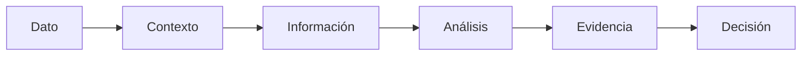
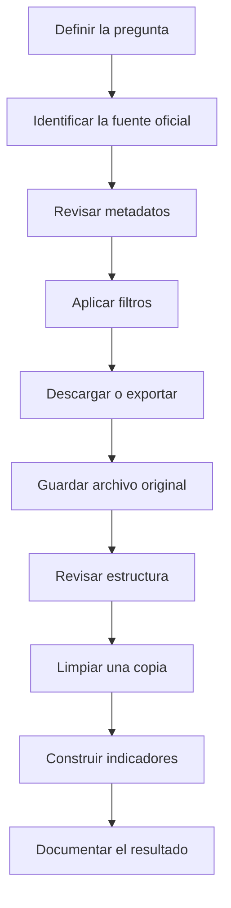
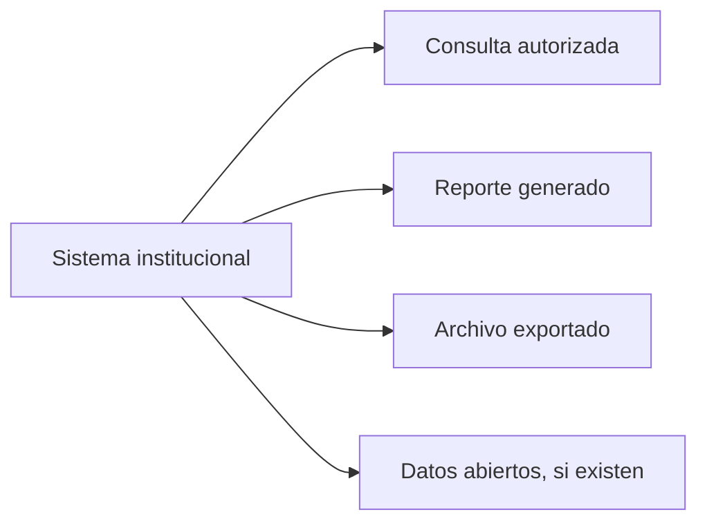
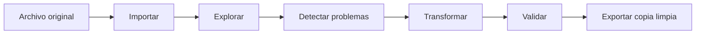
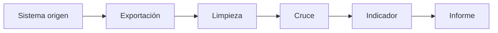
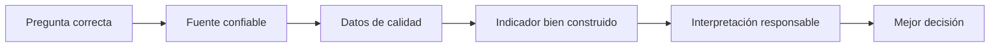

# Sesión 1 — Datos e información para la toma de decisiones en el control fiscal

**Curso:** Analítica de Datos e Inteligencia Artificial para la Gestión Pública  
**Entidad:** Contraloría General de Boyacá  
**Duración:** 8 horas  
**Horario:** 8:00 a. m. a 12:00 p. m. y 2:00 p. m. a 6:00 p. m.

---

## Propósito de la sesión

En la gestión pública se producen grandes cantidades de datos: contratos, presupuestos, pagos, proyectos de inversión, información contable, indicadores territoriales, reportes de ejecución, deuda pública y documentos de rendición de cuentas.

El reto no consiste únicamente en **tener datos**, sino en convertirlos en información que permita formular mejores preguntas, contrastar fuentes, construir indicadores y orientar procesos de revisión y control.

Durante esta sesión se trabajará con situaciones relacionadas con el contexto de la **Contraloría General de Boyacá**, utilizando fuentes oficiales y conjuntos de datos públicos.

> [!IMPORTANT]
> Un dato, una diferencia entre fuentes o un valor atípico no demuestra por sí solo la existencia de una irregularidad.  
> El análisis de datos permite identificar señales, comportamientos y preguntas que posteriormente deben ser verificadas mediante contexto, documentos y evidencia.

---

## Resultados esperados

Al finalizar la jornada se espera que cada participante pueda:

- Diferenciar dato, información, indicador y evidencia.
- Reconocer diferentes tipos y fuentes de datos del sector público.
- Identificar fuentes oficiales útiles para el control fiscal.
- Obtener información desde portales públicos y convertirla en un conjunto de datos utilizable.
- Reconocer problemas comunes de calidad de datos.
- Aplicar operaciones básicas de limpieza y estandarización.
- Comprender principios básicos de gobernanza, trazabilidad y documentación.
- Construir indicadores sencillos relacionados con gestión pública.
- Interpretar un indicador sin sacar conclusiones que los datos no permiten sustentar.

---

# 1. Del dato a la decisión

Observe las siguientes afirmaciones:

> El municipio A ejecutó el 94 % de su presupuesto.

> El municipio B registró contratos por $18.000 millones.

> El municipio C aumentó su deuda en 32 %.

Antes de utilizar cualquiera de estas afirmaciones para orientar una decisión, deberían surgir preguntas como:

- ¿De qué vigencia estamos hablando?
- ¿Cuál es la fuente?
- ¿Cuándo fue actualizado el dato?
- ¿Qué significa exactamente “ejecutó”?
- ¿Se habla de compromisos, obligaciones o pagos?
- ¿El valor corresponde al presupuesto inicial o definitivo?
- ¿Los contratos corresponden a procesos publicados, adjudicados o contratos efectivamente celebrados?
- ¿La variación de deuda se calcula frente a qué periodo?
- ¿Los valores están expresados en pesos corrientes o constantes?
- ¿La información está completa?
- ¿Existe otra fuente con la cual pueda contrastarse?

Esta es la primera idea de la jornada:



Un número aislado tiene un valor limitado. Su utilidad aumenta cuando conocemos su significado, procedencia, periodo, unidad de medida, forma de cálculo y limitaciones.

---

# 2. Dato, información, indicador y evidencia

| Concepto | Ejemplo |
|---|---|
| **Dato** | `$4.500.000.000` |
| **Información** | Valor inicial de un contrato de obra pública |
| **Contexto** | Contrato celebrado por una entidad territorial de Boyacá durante una vigencia determinada |
| **Indicador** | Porcentaje de avance financiero del contrato |
| **Evidencia** | Datos de contratación contrastados con documentos contractuales, ejecución y otras fuentes |
| **Decisión** | Determinar si se requiere profundizar la revisión |

## Actividad 1 — ¿Qué falta para poder decidir?

Para cada afirmación, identifique por lo menos **tres datos adicionales** que necesitaría conocer.

### Caso A

> Una entidad ejecutó el 91 % de su presupuesto.

**Información adicional necesaria:**

1.  
2.  
3.  

### Caso B

> Un contrato aumentó su valor en un 35 %.

**Información adicional necesaria:**

1.  
2.  
3.  

### Caso C

> Un municipio presenta una ejecución inferior al promedio departamental.

**Información adicional necesaria:**

1.  
2.  
3.  

---

# 3. Tipos de datos que encontramos en el sector público

Los datos no siempre llegan en forma de una tabla organizada.

## 3.1 Datos estructurados

Tienen una estructura definida de filas y columnas.

Ejemplos:

- CSV
- Excel
- tablas de bases de datos
- archivos exportados de sistemas institucionales

Ejemplo:

| municipio | vigencia | presupuesto_definitivo | compromisos |
|---|---:|---:|---:|
| Tunja | 2025 | 1000000000 | 850000000 |
| Duitama | 2025 | 850000000 | 710000000 |

---

## 3.2 Datos semiestructurados

Contienen una estructura reconocible, aunque no necesariamente se presentan como una tabla.

Ejemplos:

- JSON
- XML
- respuestas de una API
- registros provenientes de servicios web

Ejemplo:

```json
{
  "municipio": "Tunja",
  "vigencia": 2025,
  "presupuesto_definitivo": 1000000000,
  "compromisos": 850000000
}
```

---

## 3.3 Datos no estructurados

No están organizados originalmente en filas y columnas.

Ejemplos:

- contratos en PDF
- estudios previos
- informes de auditoría
- actas
- fotografías
- documentos Word
- correos
- imágenes escaneadas

Durante las siguientes sesiones se utilizarán herramientas de analítica e inteligencia artificial para trabajar también con este tipo de información.

---

# 4. Fuentes de datos para el control fiscal

Durante el curso se utilizarán principalmente fuentes oficiales.

## Fuentes nacionales

| Fuente | Información de interés |
|---|---|
| **SIA Contralorías** | Información rendida por sujetos de control |
| **SIA Observa** | Información asociada a contratación y seguimiento |
| **SECOP / Colombia Compra Eficiente** | Procesos de contratación y contratos |
| **Datos Abiertos Colombia** | Conjuntos de datos publicados por entidades del Estado |
| **CHIP / CUIPO** | Información contable, financiera, presupuestal y territorial |
| **DANE** | Población, territorio, estadísticas sociales y económicas |
| **DIVIPOLA** | Códigos oficiales de departamentos y municipios |
| **TerriData – DNP** | Indicadores y caracterización territorial |
| **MapaInversiones – DNP** | Proyectos de inversión y ejecución de recursos |

La Contraloría General de Boyacá utiliza, entre otros, formatos relacionados con:

- catálogo de cuentas;
- movimientos bancarios;
- pólizas;
- ejecución presupuestal de ingresos;
- ejecución presupuestal de gastos;
- pagos;
- modificaciones presupuestales;
- reservas;
- cuentas por pagar;
- contratación;
- deuda pública;
- fiducias;
- inversión ambiental.

---

## Fuentes internacionales que conoceremos durante el curso

| Fuente | Utilidad |
|---|---|
| **Open Contracting Data Standard — OCDS** | Comprender estructuras y estándares internacionales de contratación pública |
| **Banco Mundial — Open Data** | Indicadores económicos, sociales y de desarrollo |
| **OECD Data Explorer** | Indicadores comparables sobre gobierno, economía y gestión pública |
| **Banco Interamericano de Desarrollo — Open Data** | Información económica y social de América Latina y el Caribe |

---

# 5. Una fuente no siempre es un dataset

Es importante diferenciar entre:

- **Sistema de información:** plataforma donde una entidad registra o administra información.
- **Portal de consulta:** permite visualizar información mediante filtros.
- **Portal de datos abiertos:** permite descargar datos reutilizables.
- **Reporte:** presenta información ya procesada.
- **Dataset:** conjunto de datos que puede ser procesado nuevamente.
- **API:** mecanismo que permite solicitar datos directamente desde un sistema mediante software.

Por ejemplo, consultar un contrato en pantalla y descargar un archivo CSV con miles de contratos son dos formas diferentes de acceder a información.

Durante el curso se buscará, siempre que sea posible, llegar hasta un archivo como:

```text
.csv
.xlsx
.json
.geojson
```

que posteriormente pueda analizarse.

---

# 6. Ruta general para obtener un dataset

Cada vez que se consulte una fuente oficial se seguirá la misma lógica.



Antes de descargar cualquier archivo deben identificarse, como mínimo:

- nombre de la fuente;
- entidad responsable;
- fecha de consulta;
- fecha de actualización;
- periodo de los datos;
- unidad de medida;
- cobertura geográfica;
- significado de las principales variables.

---

# 7. Cómo obtendremos datos desde las principales fuentes

## 7.1 SECOP II y Datos Abiertos Colombia

El portal Datos Abiertos Colombia publica conjuntos de datos de **SECOP II** suministrados por la Agencia Nacional de Contratación Pública — Colombia Compra Eficiente.

Uno de los conjuntos que utilizaremos es:

**SECOP II — Procesos de Contratación**

Este conjunto contiene millones de registros y variables como:

- entidad;
- NIT de la entidad;
- departamento;
- ciudad;
- ID del proceso;
- modalidad de contratación;
- fechas;
- estado;
- descripción;
- precio base;
- proveedor, según el conjunto consultado;
- información asociada al proceso.

### Ruta de descarga

1. Ingrese a **Datos Abiertos Colombia**.
2. Busque:

   `SECOP II - Procesos de Contratación`

3. Abra el conjunto publicado por **Colombia Compra Eficiente**.
4. Revise primero la descripción y las columnas.
5. Utilice los filtros del portal.
6. Para ejercicios departamentales puede utilizar:

   `Departamento Entidad = Boyacá`

7. Utilice la opción **Exportar**.
8. Seleccione un formato como **CSV**.

> [!TIP]
> No es necesario descargar millones de registros para comenzar un análisis.  
> Es preferible filtrar primero la información necesaria.

Datos Abiertos Colombia también permite consultar los conjuntos mediante **API** y **OData**. Estas opciones serán utilizadas más adelante para automatizar descargas y mantener análisis actualizables.

### Dataset oficial

[SECOP II — Procesos de Contratación](https://www.datos.gov.co/w/p6dx-8zbt)

### Segundo conjunto que utilizaremos

[SECOP II — Contratos Electrónicos](https://www.datos.gov.co/Gastos-Gubernamentales/SECOP-II-Contratos-Electr-nicos/jbjy-vk9h)

---

# 8. TerriData — DNP

TerriData permite consultar y comparar información territorial.

Puede ser útil para complementar un análisis fiscal con información como:

- población;
- características territoriales;
- finanzas públicas;
- educación;
- salud;
- economía;
- condiciones sociales;
- indicadores municipales y departamentales.

### Ruta de descarga

1. Ingrese a **TerriData**.
2. Explore una **Ficha** territorial para conocer un municipio.
3. Ingrese posteriormente a **Descargas**.
4. Seleccione la base o temática de interés.
5. Seleccione las entidades territoriales requeridas.
6. Exporte la información disponible.
7. Guarde una copia sin modificar.

### Portal

[TerriData — Departamento Nacional de Planeación](https://terridata.dnp.gov.co/)

---

# 9. MapaInversiones — DNP

MapaInversiones permite explorar proyectos de inversión pública y consultar información relacionada con:

- presupuesto aprobado;
- recursos comprometidos;
- recursos ejecutados;
- avance financiero;
- avance físico;
- sector;
- entidad responsable;
- ubicación;
- fuentes de financiación.

### Ruta de trabajo

1. Ingrese a **MapaInversiones**.
2. Localice un territorio, entidad o proyecto.
3. Revise la ficha del proyecto.
4. Identifique la fecha de corte.
5. Consulte presupuesto, ejecución y avance.
6. Utilice las opciones disponibles para **descargar el reporte** o **exportar datos a Excel**.
7. Registre la fecha de consulta y los filtros utilizados.

### Portal

[MapaInversiones — Departamento Nacional de Planeación](https://mapainversiones.dnp.gov.co/)

---

# 10. DANE y DIVIPOLA

El DANE será una fuente fundamental para complementar los datos financieros y contractuales con información territorial y poblacional.

## ¿Qué es DIVIPOLA?

DIVIPOLA es la codificación oficial utilizada para identificar departamentos, municipios, áreas no municipalizadas y centros poblados.

Ejemplo conceptual:

```text
15     → Boyacá
15001  → Tunja
```

Los códigos permiten realizar cruces de información de forma más segura que los nombres escritos manualmente.

Por ejemplo:

```text
TUNJA
Tunja
tunja
TUNJA 
```

pueden representar el mismo municipio, pero producir problemas al cruzar bases.

El código:

```text
15001
```

es una llave mucho más estable.

### Formas de obtener información del DANE

Dependiendo del producto consultado, el DANE publica:

- archivos XLSX;
- archivos CSV;
- anexos estadísticos;
- GeoJSON;
- Shapefile;
- KML;
- servicios geográficos mediante API.

El Geoportal del DANE permite además consultar servicios de DIVIPOLA y descargar información geográfica.

### Geoportal

[Geoportal del DANE](https://geoportal.dane.gov.co/)

---

# 11. CHIP

El **Consolidador de Hacienda e Información Pública — CHIP** permite consultar información reportada por entidades públicas.

La información puede incluir categorías contables, financieras, económicas y presupuestales.

### Ruta general de consulta

1. Ingrese al portal CHIP.
2. Acceda a las opciones de consulta o **Informe al ciudadano**.
3. Busque una entidad por nombre o código.
4. Seleccione la categoría de información.
5. Seleccione el periodo.
6. Seleccione el formulario disponible.
7. Ejecute la consulta.
8. Registre los filtros utilizados.
9. Utilice las opciones de descarga, exportación o reporte disponibles para la consulta realizada.

La disponibilidad de consultas masivas puede depender del tipo de información, del módulo y de las capacidades habilitadas en la plataforma.

### Portal

[CHIP — Contaduría General de la Nación](https://www.chip.gov.co/)

> [!IMPORTANT]
> Cuando una plataforma no permita descargar directamente una base completa, la información visualizada sigue siendo útil, pero debe documentarse claramente cómo fue obtenida.  
> Nunca debe presentarse una transcripción manual como si fuera una descarga oficial del sistema.

---

# 12. SIA Contralorías y SIA Observa

La Contraloría General de Boyacá dispone de información y formatos asociados con **SIA Contralorías** y **SIA Observa**.

No toda plataforma institucional funciona como un portal abierto de descarga masiva.

En estos casos se debe distinguir entre:



Para los ejercicios del curso se trabajará únicamente con:

- información pública;
- archivos suministrados específicamente para la actividad;
- conjuntos de datos previamente anonimizados cuando sea necesario.

### Recursos de la Contraloría General de Boyacá

[Formatos de rendición de cuentas](https://cgb.gov.co/inicio/rendicion-de-cuentas/)

[Tutoriales SIA Observa](https://cgb.gov.co/inicio/tutoriales-sia-observa/)

---

# 13. Actividad — Cacería del dato público

Cada equipo trabajará con un municipio de Boyacá.

## Objetivo

Localizar información oficial y registrar correctamente su procedencia.

## Fuentes sugeridas

- DANE
- TerriData
- SECOP II
- MapaInversiones
- CHIP

## Preguntas

### 1. Información territorial

¿Cuál es el código DIVIPOLA del municipio?

**Respuesta:**

**Fuente:**

**Fecha de consulta:**

---

### 2. Población

Encuentre un dato reciente de población.

**Valor:**

**Año o periodo:**

**Fuente:**

**Fecha de actualización de la fuente:**

---

### 3. Contratación

Localice procesos de contratación asociados con entidades ubicadas en el municipio.

**Fuente:**

**Número de registros observados:**

**Filtro utilizado:**

**Periodo:**

---

### 4. Inversión

Localice por lo menos un proyecto de inversión relacionado con el territorio.

**Proyecto:**

**Entidad responsable:**

**Valor:**

**Avance físico, si está disponible:**

**Avance financiero, si está disponible:**

**Fecha de corte:**

---

### 5. Presupuesto o información financiera

Localice información presupuestal o financiera de una entidad del territorio.

**Entidad:**

**Fuente:**

**Categoría o formulario:**

**Periodo:**

**Dato encontrado:**

---

# 14. ¿Qué debemos guardar junto con un dataset?

Descargar un archivo no es suficiente.

Cada conjunto de datos debería poder responder:

| Pregunta | Ejemplo |
|---|---|
| ¿De dónde salió? | SECOP II |
| ¿Quién publica la información? | Colombia Compra Eficiente |
| ¿Cuándo se descargó? | 2026-10-03 |
| ¿Qué filtros se utilizaron? | Departamento Entidad = Boyacá |
| ¿Qué periodo contiene? | Vigencia seleccionada |
| ¿Cuál es el archivo original? | `secop_boyaca_original.csv` |
| ¿Qué modificaciones se realizaron? | Limpieza de nombres y fechas |
| ¿Cuál es el archivo procesado? | `secop_boyaca_limpio.csv` |

---

# 15. Conservar siempre el archivo original

Durante todo el curso utilizaremos una estructura semejante a esta:

```text
analitica_control_fiscal/
│
├── 00_originales/
│   └── datos_descargados_sin_modificar.csv
│
├── 01_trabajo/
│   └── datos_en_proceso.csv
│
├── 02_limpios/
│   └── datos_limpios.csv
│
├── 03_indicadores/
│   └── resultados.xlsx
│
└── 04_evidencias/
    └── ficha_fuente.md
```

> [!CAUTION]
> Nunca modifique directamente el único archivo descargado desde una fuente oficial.

El archivo original permite:

- repetir el proceso;
- verificar resultados;
- identificar cambios;
- corregir errores;
- mantener trazabilidad.

---

# 16. Calidad de datos

Considere la siguiente tabla:

| municipio | nit | vigencia | presupuesto | ejecutado |
|---|---|---:|---:|---:|
| Tunja | 891800846 | 2025 | 500000000 | 430000000 |
| TUNJA | 891800846-1 | 2025 | $500.000.000 | 430000000 |
| tunja |  | 25 | 500000000 |  |
| Duitamá | 891855138 | 2025 | 420000000 | 455000000 |
| Duitama | 891855138 | 2025 | 420000000 | 455000000 |

Antes de calcular un indicador debemos revisar la calidad.

## Dimensiones básicas

### Completitud

¿Faltan datos?

Ejemplo:

```text
nit = vacío
```

---

### Validez

¿El dato cumple las reglas esperadas?

Ejemplo:

```text
vigencia = 25
```

si esperamos:

```text
2025
```

---

### Consistencia

¿El dato está representado de la misma manera?

```text
Tunja
TUNJA
tunja
```

---

### Unicidad

¿Existen registros repetidos?

---

### Oportunidad

¿La información corresponde al periodo requerido y está actualizada?

---

### Exactitud

¿El dato representa correctamente el hecho que pretende describir?

---

# 17. Actividad — El dato también se audita

Analice el archivo entregado para la actividad e identifique:

- valores faltantes;
- duplicados;
- nombres escritos de diferentes maneras;
- fechas inconsistentes;
- valores monetarios almacenados como texto;
- códigos incompletos;
- valores imposibles o que requieren revisión;
- posibles problemas de unidad de medida.

Complete:

| Problema | Registro | Posible causa | Acción propuesta |
|---|---|---|---|
| | | | |
| | | | |
| | | | |
| | | | |

---

# 18. Limpieza con OpenRefine

**OpenRefine** es una herramienta libre y de código abierto diseñada para explorar, limpiar y transformar datos.

Durante la práctica se utilizará para:

- detectar valores similares;
- agrupar categorías;
- eliminar espacios;
- transformar texto;
- identificar datos vacíos;
- revisar duplicados;
- convertir tipos de datos;
- estandarizar valores.

## Flujo de trabajo



El resultado de la actividad será un nuevo archivo.

```text
datos_sucios.csv
        ↓
OpenRefine
        ↓
datos_limpios.csv
```

El original se conserva.

---

# 19. Gobernanza de datos

Imagine que recibe estos archivos:

```text
presupuesto.xlsx
presupuesto_final.xlsx
presupuesto_final2.xlsx
presupuesto_CORREGIDO.xlsx
presupuesto_FINAL_BUENO.xlsx
```

¿Cuál corresponde a la información oficial?

Este problema no se resuelve con inteligencia artificial. Requiere gobernanza.

## Conceptos fundamentales

### Productor del dato

Genera o registra la información.

### Responsable del dato

Define su significado, reglas y uso.

### Custodio

Garantiza almacenamiento, disponibilidad y protección.

### Consumidor

Utiliza la información para análisis o decisiones.

### Metadatos

Información que describe los datos.

Ejemplos:

- nombre;
- definición;
- fuente;
- tipo;
- unidad;
- fecha de actualización.

### Linaje

Permite identificar el recorrido de un dato:



---

# 20. Construcción de indicadores

Un indicador transforma datos en una medida útil para el análisis.

## Ejemplo 1 — Ejecución presupuestal

\[
\text{Ejecución presupuestal} =
\frac{\text{Compromisos}}
{\text{Apropiación definitiva}}
\times 100
\]

Si:

```text
Apropiación definitiva = $1.000.000.000
Compromisos             =   $830.000.000
```

entonces:

\[
\text{Ejecución} = 83\%
\]

Esto describe el comportamiento del indicador.

No significa automáticamente:

```text
83 % = buena gestión
```

ni:

```text
83 % = mala gestión
```

Para interpretarlo se necesita contexto.

---

## Ejemplo 2 — Porcentaje de recaudo

\[
\text{Recaudo} =
\frac{\text{Ingresos recaudados}}
{\text{Ingresos definitivos}}
\times 100
\]

---

## Ejemplo 3 — Variación

\[
\text{Variación porcentual} =
\frac{\text{Valor actual} - \text{Valor anterior}}
{\text{Valor anterior}}
\times 100
\]

---

## Ejemplo 4 — Completitud

\[
\text{Completitud} =
\frac{\text{Campos obligatorios diligenciados}}
{\text{Campos obligatorios esperados}}
\times 100
\]

---

# 21. Actividad — Diseñe un indicador

Complete la ficha.

## Nombre

---

## Pregunta que pretende responder

---

## Fuente de información

---

## Numerador

---

## Denominador

---

## Fórmula

---

## Unidad de medida

---

## Periodicidad

---

## Nivel de análisis

- [ ] Departamento
- [ ] Municipio
- [ ] Entidad
- [ ] Contrato
- [ ] Proyecto
- [ ] Otro

---

## Fecha de corte

---

## ¿Cómo debe interpretarse?

---

## ¿Qué NO permite concluir este indicador?

---

## Limitaciones

---

# 22. Reto final — Boyacá 360°

El reto de cierre consiste en construir un pequeño análisis de un territorio utilizando varias fuentes.

## Paso 1 — Pregunta

Formule una pregunta concreta.

Ejemplos:

- ¿Cómo se comporta un indicador presupuestal de una entidad?
- ¿Qué procesos contractuales aparecen asociados con determinada entidad?
- ¿Qué proyectos de inversión se encuentran relacionados con el municipio?
- ¿Qué variables territoriales podrían aportar contexto al análisis?

---

## Paso 2 — Fuentes

Utilice por lo menos **dos fuentes oficiales**.

Ejemplo:

```text
SECOP II + TerriData
```

o:

```text
MapaInversiones + DANE
```

---

## Paso 3 — Datos

Registre:

| Elemento | Información |
|---|---|
| Fuente 1 | |
| Fuente 2 | |
| Fecha de consulta | |
| Periodo analizado | |
| Filtros aplicados | |
| Número de registros | |

---

## Paso 4 — Calidad

Identifique por lo menos un aspecto que deba verificarse antes de utilizar los datos.

---

## Paso 5 — Indicador

Construya por lo menos un indicador.

---

## Paso 6 — Interpretación

Redacte una conclusión de máximo cinco líneas.

La conclusión debe diferenciar:

- lo que los datos muestran;
- lo que puede inferirse;
- lo que aún debe verificarse.

---

# 23. Principios para trabajar con datos públicos

Durante todo el curso aplicaremos las siguientes reglas:

1. **Identificar siempre la fuente.**
2. **Registrar la fecha de consulta.**
3. **Conservar el archivo original.**
4. **No modificar datos originales sin mantener una copia.**
5. **Documentar filtros y transformaciones.**
6. **Preferir identificadores oficiales sobre nombres escritos manualmente.**
7. **Verificar unidades y periodos antes de comparar.**
8. **Contrastar información cuando sea posible.**
9. **No confundir correlación, anomalía o diferencia con irregularidad.**
10. **No cargar información reservada, confidencial o personal en servicios externos no autorizados.**
11. **Mantener trazabilidad desde la fuente hasta el resultado.**
12. **Poder explicar cómo se obtuvo cada cifra presentada.**

---

# 24. Lista de verificación antes de utilizar un dataset

Antes de comenzar cualquier análisis:

- [ ] Sé quién publica los datos.
- [ ] Conozco la fecha de actualización.
- [ ] Conozco el periodo analizado.
- [ ] Comprendo qué representa cada fila.
- [ ] Comprendo las variables principales.
- [ ] Verifiqué las unidades.
- [ ] Revisé valores faltantes.
- [ ] Revisé duplicados.
- [ ] Revisé identificadores.
- [ ] Conservé el archivo original.
- [ ] Registré los filtros utilizados.
- [ ] Puedo reproducir la forma en que obtuve los datos.

---

# 25. El principio más importante de la sesión



La analítica de datos no comienza con una gráfica.

Tampoco comienza con inteligencia artificial.

Comienza con una pregunta clara y con la capacidad de reconocer:

> **qué dato necesitamos, quién lo produce, cómo podemos obtenerlo, qué significa y hasta dónde podemos utilizarlo para sustentar una decisión.**

---

# Recursos oficiales utilizados en esta sesión

- [Contraloría General de Boyacá — Formatos de rendición de cuentas](https://cgb.gov.co/inicio/rendicion-de-cuentas/)
- [Contraloría General de Boyacá — Tutoriales SIA Observa](https://cgb.gov.co/inicio/tutoriales-sia-observa/)
- [Datos Abiertos Colombia](https://www.datos.gov.co/)
- [SECOP II — Procesos de Contratación](https://www.datos.gov.co/w/p6dx-8zbt)
- [SECOP II — Contratos Electrónicos](https://www.datos.gov.co/Gastos-Gubernamentales/SECOP-II-Contratos-Electr-nicos/jbjy-vk9h)
- [CHIP — Contaduría General de la Nación](https://www.chip.gov.co/)
- [DANE](https://www.dane.gov.co/)
- [Geoportal DANE](https://geoportal.dane.gov.co/)
- [TerriData — DNP](https://terridata.dnp.gov.co/)
- [MapaInversiones — DNP](https://mapainversiones.dnp.gov.co/)
- [Open Contracting Data Standard](https://standard.open-contracting.org/latest/es/)
- [World Bank Open Data](https://data.worldbank.org/)
- [OECD Data Explorer](https://data-explorer.oecd.org/)
- [BID Open Data](https://data.iadb.org/)
