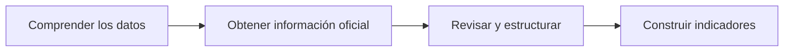
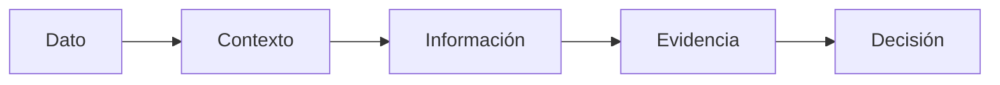
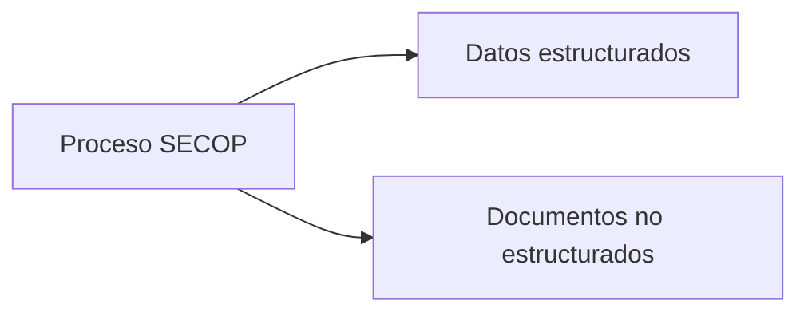
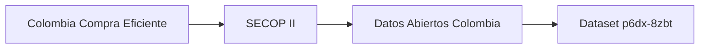
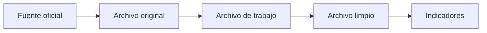
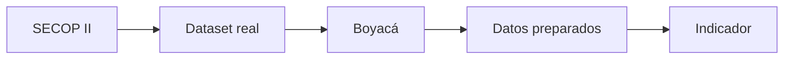

# Sesión 1 — Datos e información para la toma de decisiones

**Curso:** Analítica de Datos e Inteligencia Artificial para la Gestión Pública  
**Entidad:** Contraloría General de Boyacá

---

## Propósito de la sesión

Durante esta jornada se trabajará con información pública real relacionada con contratación estatal.

El conjunto de datos principal será:

**SECOP II — Procesos de Contratación**

Fuente oficial:

[Datos Abiertos Colombia — SECOP II Procesos de Contratación](https://www.datos.gov.co/w/p6dx-8zbt)

Identificador del dataset:

```text
p6dx-8zbt
```

Este conjunto contiene millones de registros de procesos de contratación pública y decenas de variables relacionadas con:

- entidades;
- departamentos;
- municipios;
- procesos;
- modalidades;
- fechas;
- valores;
- proveedores;
- estados;
- descripciones;
- identificadores;
- enlaces al proceso original.

Durante la sesión se trabajará principalmente con registros correspondientes a **Boyacá** y con una vigencia cerrada, preferiblemente **2025**.

La jornada seguirá este recorrido:



---

# Datos e información para la toma de decisiones

## Pregunta inicial

> **¿Qué convierte un dato en información útil para la gestión pública y el control fiscal?**

---

## 1. Un dato aislado no siempre dice mucho

Observe:

```text
350000000
```

Por sí solo, este número tiene poco significado.

Si agregamos:

```text
Precio base de un proceso de contratación.
```

ya tenemos información.

Si además conocemos:

```text
Entidad pública
Departamento: Boyacá
Vigencia: 2025
Modalidad de contratación
Fecha de publicación
Objeto contractual
```

tenemos contexto.



---

## 2. Ejemplo con SECOP II

Suponga que encontramos:

```text
Precio Base = 350000000
```

Antes de interpretar este valor deberíamos preguntar:

- ¿A qué proceso corresponde?
- ¿Qué entidad lo publicó?
- ¿Cuál es el objeto?
- ¿En qué municipio?
- ¿Qué modalidad se utilizó?
- ¿Cuál es la fecha?
- ¿El proceso fue adjudicado?
- ¿Cuál fue el valor finalmente adjudicado?
- ¿Qué documentos respaldan el proceso?

---

## 3. Algunas variables que encontraremos

En SECOP II pueden encontrarse variables como:

```text
Entidad
Nit Entidad
Departamento Entidad
Ciudad Entidad
ID del Proceso
Referencia del Proceso
Nombre del Procedimiento
Descripción del Procedimiento
Fase
Modalidad de Contratación
Fecha de Publicación
Precio Base
Adjudicado
Nombre del Proveedor
Valor Total Adjudicación
URLProceso
```

---

## 4. Tipos de datos dentro del mismo dataset

| Variable | Tipo conceptual |
|---|---|
| Entidad | Texto |
| NIT Entidad | Identificador |
| Departamento Entidad | Categoría |
| Ciudad Entidad | Categoría |
| ID del Proceso | Identificador |
| Descripción | Texto libre |
| Fecha de Publicación | Fecha |
| Precio Base | Número |
| Adjudicado | Categoría |
| Valor Total Adjudicación | Número |
| URLProceso | Enlace |

---

## 5. Datos estructurados

Un dataset como SECOP II es un ejemplo de información estructurada.

```text
CSV
XLSX
Tabla
Base de datos
```

Ejemplo simplificado:

| entidad | ciudad | modalidad | precio_base |
|---|---|---|---:|
| Entidad A | Tunja | Selección abreviada | 350000000 |
| Entidad B | Duitama | Mínima cuantía | 45000000 |

---

## 6. Datos semiestructurados

La misma información puede obtenerse mediante servicios que entregan:

```text
JSON
XML
```

Ejemplo:

```json
{
  "departamento_entidad": "Boyacá",
  "ciudad_entidad": "Tunja",
  "precio_base": 350000000
}
```

---

## 7. Datos no estructurados

Un proceso de contratación también puede tener documentos asociados.

Ejemplos:

```text
Estudios previos
Pliegos
Informes de evaluación
Observaciones
Ofertas
Contratos
Actas
PDF
Word
Imágenes
```

Esto permite diferenciar:



---

## Taller — ¿Qué representa cada dato?

Utilice un registro real del conjunto SECOP II.

Seleccione al menos diez columnas y complete:

| Variable | Valor encontrado | Tipo de dato | ¿Qué representa? |
|---|---|---|---|
| | | | |
| | | | |
| | | | |
| | | | |
| | | | |
| | | | |
| | | | |
| | | | |
| | | | |
| | | | |

---

## Pregunta de cierre

Observe un registro y responda:

```text
¿Qué sabemos?
¿Qué no sabemos?
¿Qué información adicional necesitaríamos antes de tomar una decisión?
```

---

# Tipos y fuentes de datos en el sector público

## Pregunta central

> **¿Dónde encontramos información pública y cómo podemos obtenerla para trabajar con ella?**

---

## 1. Fuente principal de la actividad

Durante la práctica utilizaremos:

**SECOP II — Procesos de Contratación**

[Acceder al dataset](https://www.datos.gov.co/w/p6dx-8zbt)

Identificador:

```text
p6dx-8zbt
```

---

## 2. De dónde viene la información



---

## Descarga parcial de datasets grandes

En Datos Abiertos Colombia algunos conjuntos de datos pueden tener millones de registros y superar varios GB de tamaño. En estos casos no siempre es necesario descargar el archivo completo.

Muchos datasets publicados en datos.gov.co utilizan la API de **Socrata**, lo que permite consultar únicamente una parte de los registros agregando el parámetro `$limit` a la URL.

Por ejemplo:

```text
https://www.datos.gov.co/resource/p6dx-8zbt.json?$limit=100
```

En este caso:

- `p6dx-8zbt` identifica el dataset.
- `.json` indica que queremos obtener los datos en formato JSON.
- `$limit=100` indica que queremos descargar únicamente 100 registros.

Podemos modificar el límite fácilmente:

```text
$limit=10
$limit=100
$limit=1000
$limit=5000
```

Por ejemplo:

```text
https://www.datos.gov.co/resource/p6dx-8zbt.json?$limit=1000
```

Esto es especialmente útil cuando el dataset completo es muy pesado, por ejemplo de **5 GB o más**, y solamente necesitamos una muestra para explorar su estructura, identificar variables, revisar la calidad de los datos o comenzar un análisis.

> Para las actividades del curso no siempre será necesario descargar el dataset completo. Podemos comenzar trabajando con una muestra utilizando `$limit`.

---

## 3. Cómo obtener los datos

### Desde el portal

Ruta sugerida:

```text
Abrir SECOP II - Procesos de Contratación
↓
Revisar columnas
↓
Aplicar filtros
↓
Departamento Entidad = Boyacá
↓
Seleccionar periodo
↓
Exportar
↓
CSV
```

---

## 4. Filtro recomendado

Para trabajar con un conjunto manejable:

```text
Departamento Entidad = Boyacá
```

y preferiblemente:

```text
Vigencia o fecha correspondiente a 2025
```

El objetivo no es descargar todo el conjunto nacional.

---

## 5. Archivo de trabajo

El archivo descargado puede guardarse como:

```text
secop_boyaca_2025_original.csv
```

Ese archivo debe conservarse sin modificaciones.

Luego puede crearse una copia:

```text
secop_boyaca_2025_trabajo.csv
```

---

## 6. Otra forma de acceder al dataset

La plataforma también permite consultar el conjunto mediante servicios de datos.

Ejemplo:

```text
https://www.datos.gov.co/resource/p6dx-8zbt.json
```

Esto corresponde al mismo dataset en formato JSON.

En esta sesión solamente es necesario reconocer que esta forma de acceso existe.

---

## 7. Del dataset al proceso real

Una de las columnas más útiles es:

```text
URLProceso
```

Esta permite pasar de la fila del dataset al proceso original.


---

## 8. Documentos no estructurados

Dentro del proceso pueden encontrarse, dependiendo del caso:

```text
Estudios previos
Pliegos
Informes
Observaciones
Ofertas
Documentos contractuales
Actas
```

La actividad consiste en obtener:

```text
1 dataset estructurado
+
1 documento no estructurado
```

del mismo contexto contractual.

---

## Taller — Descarguemos datos reales

Cada grupo debe obtener un subconjunto de SECOP II correspondiente a Boyacá.

### Registro del ejercicio

```text
Fuente:

Dataset:

ID del dataset:

Filtro territorial:

Periodo:

Fecha de consulta:

Formato descargado:

Nombre del archivo:
```

---

## Archivo estructurado

Ejemplo:

```text
secop_boyaca_2025_original.csv
```

---

## Documento no estructurado

Seleccione un proceso del dataset y descargue un documento público asociado.

Ejemplo:

```text
estudio_previo.pdf
```

o:

```text
pliego.pdf
```

---

## Carpeta sugerida

```text
secop_boyaca/
│
├── datos/
│   └── secop_boyaca_2025_original.csv
│
└── documentos/
    └── proceso_ejemplo/
        └── documento.pdf
```

---

## Otras fuentes que pueden consultarse

Además de SECOP II, durante el curso se utilizarán fuentes como:

| Fuente | Información |
|---|---|
| SIA Contralorías | Rendición de cuentas |
| SIA Observa | Información contractual |
| CHIP / CUIPO | Presupuesto y finanzas públicas |
| DANE | Estadísticas oficiales |
| TerriData | Información territorial |
| MapaInversiones | Proyectos de inversión |
| Contraloría General de Boyacá | Informes y documentos institucionales |

---

# Calidad, estructuración y gobernanza de datos

## Pregunta central

> **¿Podemos utilizar directamente el archivo descargado o debemos revisarlo primero?**

---

## 1. Primer paso: conservar el original

Nunca se debe trabajar sobre la única copia descargada.

```text
secop_boyaca_2025_original.csv
```

Debe conservarse sin modificaciones.

Trabajaremos sobre:

```text
secop_boyaca_2025_trabajo.csv
```

---

## 2. El dataset real puede contener situaciones como

```text
campos vacíos
No Definido
fechas
textos extensos
identificadores
valores monetarios
categorías
diferentes unidades
```

Antes de utilizar los datos debemos revisar su calidad.

---

## 3. Completitud

Pregunta:

> ¿Faltan datos que esperábamos encontrar?

Ejemplos:

```text
Ciudad Entidad = vacío
Nombre del Proveedor = vacío
Valor adjudicado = vacío
```

---

## 4. Consistencia

Pregunta:

> ¿Los datos se representan siempre de la misma manera?

Ejemplos a revisar:

```text
nombres de entidades
municipios
modalidades
estados
proveedores
```

---

## 5. Validez

Pregunta:

> ¿El dato cumple las reglas esperadas?

Ejemplos:

```text
¿La fecha puede interpretarse correctamente?
¿El precio base es numérico?
¿El ID del proceso está presente?
```

---

## 6. Unicidad

Pregunta:

> ¿Cada registro representa realmente un proceso diferente?

Utilice:

```text
ID del Proceso
```

para revisar si el identificador aparece más de una vez.

No elimine registros automáticamente.

Primero determine por qué aparecen repetidos.

---

## 7. Exactitud

Pregunta:

> ¿El dato representa correctamente lo que declara representar?

La exactitud no siempre puede determinarse solamente mirando el CSV.

Puede requerir consultar:

```text
Proceso original
Documentos
Fuente
```

---

## 8. Oportunidad

Pregunta:

> ¿La información corresponde al periodo que necesitamos?

Ejemplo:

```text
¿Estamos trabajando únicamente con 2025?
¿Existen procesos de otras vigencias?
```

---

## 9. Selección de variables

El dataset original contiene muchas columnas.

Para este ejercicio no necesitamos todas.

Puede construirse un conjunto de trabajo con variables como:

```text
Entidad
Nit Entidad
Departamento Entidad
Ciudad Entidad
ID del Proceso
Referencia del Proceso
Nombre del Procedimiento
Descripción del Procedimiento
Modalidad de Contratación
Fecha de Publicación
Precio Base
Adjudicado
Nombre del Proveedor
Valor Total Adjudicación
URLProceso
```

---

## 10. Transformaciones básicas

### Filtrar territorio

```text
Nacional
↓
Boyacá
```

### Filtrar periodo

```text
Todos los años
↓
2025
```

### Seleccionar columnas

```text
Todas las columnas
↓
Variables necesarias para el ejercicio
```

### Revisar valores ausentes

```text
vacío
No Definido
NULL
```

### Revisar tipos

```text
NIT                → identificador
ID Proceso         → identificador
Fecha              → fecha
Precio Base        → número
Modalidad          → categoría
Descripción        → texto
```

---

## 11. Taller — Preparemos el dataset

Trabaje sobre:

```text
secop_boyaca_2025_trabajo.csv
```

Realice las siguientes actividades:

### Actividad 1

Identifique cuántas columnas contiene el archivo.

```text

```

### Actividad 2

Seleccione entre 15 y 20 columnas útiles.

```text


```

### Actividad 3

Identifique valores:

```text
vacíos
No Definido
otros valores que requieran revisión
```

### Actividad 4

Revise los tipos de datos.

| Variable | Tipo encontrado | Tipo esperado |
|---|---|---|
| | | |
| | | |
| | | |
| | | |
| | | |

### Actividad 5

Revise si:

```text
ID del Proceso
```

parece identificar registros de manera única.

### Actividad 6

Identifique al menos cinco problemas o aspectos que requieren revisión.

| Variable | Situación encontrada | Acción |
|---|---|---|
| | | |
| | | |
| | | |
| | | |
| | | |

---

## 12. Gobernanza

Suponga que al finalizar la actividad tenemos:

```text
secop_boyaca_2025_original.csv
secop_boyaca_2025_trabajo.csv
secop_boyaca_2025_limpio.csv
```

Cada archivo tiene una función diferente.



---

## 13. Conceptos básicos de gobernanza

### Productor

Genera o registra la información.

En este caso, los datos se originan en procesos registrados en SECOP II por las entidades participantes.

### Responsable

Define reglas, significado y uso de la información.

### Custodio

Mantiene la información disponible y protegida.

### Consumidor

Utiliza los datos para consulta, análisis o toma de decisiones.

### Diccionario de datos

Permite comprender qué representa cada variable.

### Trazabilidad

Permite saber:

```text
de dónde salió el dato
qué transformaciones se realizaron
qué archivo se utilizó
cómo se obtuvo un resultado
```

---

## Taller — Documentemos las transformaciones

Complete:

| Paso | Acción realizada |
|---|---|
| Fuente original | |
| Filtro territorial | |
| Filtro temporal | |
| Columnas eliminadas | |
| Columnas conservadas | |
| Valores revisados | |
| Transformaciones aplicadas | |
| Nombre del archivo resultante | |

---

# Indicadores y métricas para la gestión pública

## Pregunta central

> **¿Cómo convertimos los datos preparados en medidas útiles y comprensibles?**

---

## 1. Dato

Ejemplo:

```text
Precio Base = 350000000
```

---

## 2. Métrica

Ejemplo:

```text
Número total de procesos
```

o:

```text
Valor total de procesos
```

---

## 3. Indicador

Un indicador relaciona uno o más datos mediante una definición clara.

Ejemplo:

```text
Porcentaje de procesos adjudicados
```

---

## 4. Procesos adjudicados

\[
\text{Porcentaje adjudicado} =
\frac{\text{Procesos adjudicados}}
{\text{Total de procesos}}
\times 100
\]

---

## 5. Participación por modalidad

Ejemplo:

\[
\text{Participación de mínima cuantía} =
\frac{\text{Procesos de mínima cuantía}}
{\text{Total de procesos}}
\times 100
\]

---

## 6. Información territorial completa

Puede construirse un indicador de calidad:

\[
\text{Completitud territorial} =
\frac{\text{Procesos con ciudad definida}}
{\text{Total de procesos}}
\times 100
\]

Este indicador conecta directamente el trabajo de calidad con la construcción de métricas.

---

## 7. Procesos con proveedor identificado

\[
\text{Proveedor identificado} =
\frac{\text{Procesos con proveedor informado}}
{\text{Total de procesos}}
\times 100
\]

---

## 8. Valor adjudicado respecto al precio base

Cuando los campos aplicables estén disponibles:

\[
\text{Relación adjudicación / precio base} =
\frac{\text{Valor total adjudicado}}
{\text{Precio base}}
\times 100
\]

Antes de calcularlo debe verificarse que ambos valores correspondan al mismo registro y tengan significado comparable.

---

## 9. Un indicador no es una conclusión automática

Suponga que obtenemos:

```text
Procesos adjudicados = 78 %
```

Esto permite afirmar:

> El 78 % de los procesos incluidos en el conjunto analizado aparecen clasificados como adjudicados según la variable utilizada.

No permite afirmar automáticamente:

```text
La entidad contrata bien.
```

```text
La entidad contrata mal.
```

```text
Existe una irregularidad.
```

---

## Taller — Construya un indicador

Seleccione una variable del dataset preparado.

Complete:

| Campo | Respuesta |
|---|---|
| Nombre | |
| Pregunta | |
| Fuente | SECOP II |
| Dataset | Procesos de Contratación |
| Numerador | |
| Denominador | |
| Fórmula | |
| Unidad | |
| Periodo | |
| Resultado | |
| ¿Qué significa? | |
| ¿Qué NO permite concluir? | |

---

## Indicadores sugeridos

Cada grupo puede seleccionar uno.

### Opción 1

```text
Porcentaje de procesos adjudicados
```

### Opción 2

```text
Porcentaje de procesos por modalidad seleccionada
```

### Opción 3

```text
Porcentaje de registros con ciudad definida
```

### Opción 4

```text
Porcentaje de procesos con proveedor identificado
```

### Opción 5

```text
Relación entre valor adjudicado y precio base
```

---

# Actividad de cierre

Cada grupo debe presentar:

```text
1. Qué información contiene el dataset.
2. Cómo obtuvo los datos.
3. Qué documento asociado descargó.
4. Qué transformaciones realizó.
5. Qué problema de calidad encontró.
6. Qué indicador construyó.
7. Cómo interpreta el resultado.
```

---

# Estructura de archivos sugerida

```text
sesion_1_secop/
│
├── 00_fuente/
│   └── fuente.md
│
├── 01_original/
│   └── secop_boyaca_2025_original.csv
│
├── 02_trabajo/
│   └── secop_boyaca_2025_trabajo.csv
│
├── 03_limpio/
│   └── secop_boyaca_2025_limpio.csv
│
├── 04_documentos/
│   └── proceso_ejemplo/
│       └── documento.pdf
│
└── 05_indicadores/
    └── indicador.md
```

---

# Lista final de verificación

## Datos e información para la toma de decisiones

- [ ] Distingo entre dato e información.
- [ ] Identifico diferentes tipos de variables.
- [ ] Comprendo la importancia del contexto.
- [ ] Reconozco datos estructurados y no estructurados.

## Tipos y fuentes de datos en el sector público

- [ ] Sé localizar SECOP II.
- [ ] Sé identificar el dataset utilizado.
- [ ] Puedo filtrar información de Boyacá.
- [ ] Puedo descargar un archivo estructurado.
- [ ] Puedo localizar un documento asociado a un proceso.

## Calidad, estructuración y gobernanza de datos

- [ ] Conservo el archivo original.
- [ ] Identifico valores faltantes.
- [ ] Reviso tipos de datos.
- [ ] Reviso identificadores.
- [ ] Documento las transformaciones.
- [ ] Comprendo la trazabilidad.

## Indicadores y métricas para la gestión pública

- [ ] Puedo construir una métrica sencilla.
- [ ] Puedo definir un indicador.
- [ ] Puedo explicar la fórmula.
- [ ] Puedo interpretar el resultado.
- [ ] Puedo explicar qué no permite concluir.

---

# Idea central



El objetivo no es únicamente descargar un archivo.

El objetivo es comprender todo el recorrido:

> **qué dato necesitamos, de dónde proviene, cómo lo obtenemos, qué transformaciones requiere y cómo podemos convertirlo en una medida útil para la gestión pública.**
