# Mapa de fuentes de datos para la gestión y el control fiscal

**Curso:** Analítica de Datos e Inteligencia Artificial para la Gestión Pública  
**Entidad:** Contraloría General de Boyacá  
**Sesión 1:** Datos e información para la toma de decisiones  
**Actualización:** octubre de 2026

---

## Propósito

Este documento presenta un mapa de fuentes de información útiles para el trabajo de la **Contraloría General de Boyacá** y para el estudio de la gestión pública.

El objetivo es reconocer:

- qué entidad produce o administra cada fuente;
- qué tipo de información puede encontrarse;
- cómo se consulta;
- si permite descargar datos;
- qué formatos pueden obtenerse;
- cuándo se requiere acceso institucional;
- cuál es el portal oficial de acceso.

> [!IMPORTANT]
> En este documento no se realizan análisis, cruces, depuración, construcción de indicadores ni identificación de anomalías.  
> El propósito es únicamente **conocer las fuentes y aprender cómo obtener información desde ellas**.

---

# 1. Mapa general

```mermaid
flowchart TD
    A["Fuentes para la gestión y el control fiscal"]

    A --> B["Contraloría y rendición"]
    A --> C["Contratación pública"]
    A --> D["Información presupuestal y financiera"]
    A --> E["Información estadística y territorial"]
    A --> F["Inversión pública"]
    A --> G["Datos abiertos"]
    A --> H["Fuentes internacionales"]

    B --> B1["SIA Contralorías"]
    B --> B2["SIA Observa"]
    B --> B3["Contraloría General de Boyacá"]

    C --> C1["SECOP I"]
    C --> C2["SECOP II"]
    C --> C3["Colombia Compra Eficiente"]

    D --> D1["CHIP"]
    D --> D2["CUIPO"]

    E --> E1["DANE"]
    E --> E2["DIVIPOLA"]
    E --> E3["Geoportal DANE"]
    E --> E4["Microdatos DANE"]
    E --> E5["TerriData"]

    F --> F1["MapaInversiones"]

    G --> G1["Datos Abiertos Colombia"]

    H --> H1["Open Contracting"]
    H --> H2["Banco Mundial"]
    H --> H3["OCDE"]
    H --> H4["BID"]
```

---

# 2. Tres formas principales de obtener información

No todos los portales públicos funcionan de la misma manera.

Durante el curso encontraremos principalmente tres formas de acceso.

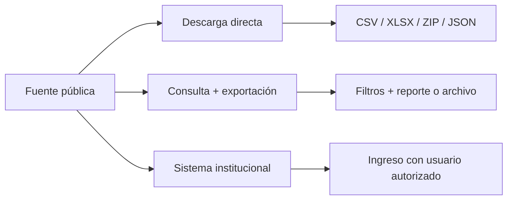

## Descarga directa

El portal ofrece un archivo listo para descargar.

Ejemplos:

- CSV;
- XLSX;
- ZIP;
- JSON;
- GeoJSON.

---

## Consulta y exportación

Primero se seleccionan filtros como:

- entidad;
- departamento;
- municipio;
- año;
- periodo;
- categoría.

Después el sistema permite generar o exportar la información disponible.

---

## Sistema institucional

La información se encuentra dentro de una plataforma que puede requerir:

- usuario;
- contraseña;
- perfil;
- permisos institucionales.

En estos casos, el acceso disponible depende del rol de cada usuario.

---

# 3. Vista rápida de las fuentes

| Fuente | Tema principal | ¿Permite obtener datos? | Forma principal |
|---|---|---:|---|
| **SIA Contralorías** | Rendición de cuentas | Sí, según perfil y módulo | Sistema institucional |
| **SIA Observa** | Contratación reportada y seguimiento | Sí, según perfil y módulo | Sistema institucional |
| **Contraloría General de Boyacá** | Formatos, rendición, documentos institucionales | Sí | Descarga de archivos |
| **SECOP II** | Procesos y contratos públicos | Sí | CSV, API, OData |
| **Datos Abiertos Colombia** | Datos publicados por entidades públicas | Sí | CSV, JSON, API, OData y otros |
| **CHIP** | Información contable, financiera y presupuestal | Sí, según consulta disponible | Consulta y reporte |
| **CUIPO** | Presupuesto ordinario | Sí, mediante CHIP y recursos asociados | Consulta/reporte |
| **DANE** | Estadísticas oficiales | Sí | XLSX, CSV, ZIP y otros |
| **Microdatos DANE** | Bases anonimizadas de operaciones estadísticas | Sí | ZIP y archivos de datos |
| **DIVIPOLA** | Códigos territoriales oficiales | Sí | Servicios y archivos geográficos |
| **Geoportal DANE** | Información geográfica | Sí | JSON, GeoJSON y servicios geográficos |
| **TerriData** | Información territorial | Sí | Descarga desde el portal |
| **MapaInversiones** | Proyectos de inversión pública | Sí, según reporte | Consulta, reporte y descarga disponible |
| **Open Contracting** | Estándares y datos de contratación | Sí, según plataforma | JSON/CSV según publicación |
| **Banco Mundial** | Indicadores internacionales | Sí | CSV, Excel, API |
| **OCDE** | Estadísticas comparables | Sí | CSV y exportación |
| **BID** | Datos de América Latina y el Caribe | Sí | Descargas según conjunto |

---

# 4. Contraloría General de Boyacá

La página institucional de la Contraloría General de Boyacá constituye un punto de entrada importante para conocer la información que deben rendir los sujetos de control.

## ¿Qué encontramos?

Entre los formatos publicados para **SIA Contralorías** se encuentran:

- catálogo de cuentas;
- movimientos de bancos;
- pólizas de aseguramiento;
- ejecución presupuestal de ingresos;
- relación de ingresos;
- ejecución presupuestal de gastos;
- relación de pagos;
- modificaciones presupuestales;
- reservas presupuestales;
- cuentas por pagar;
- contratación;
- deuda pública;
- fiducias;
- información de inversión ambiental.

## ¿Cómo se obtiene la información?

La página institucional permite principalmente:

1. consultar los formatos vigentes;
2. descargar documentos y formatos;
3. acceder a SIA Contralorías;
4. acceder a SIA Observa;
5. consultar tutoriales de SIA Observa.

## Acceso

[Contraloría General de Boyacá — Rendición de cuentas](https://cgb.gov.co/inicio/rendicion-de-cuentas/)

[Contraloría General de Boyacá — Datos abiertos](https://cgb.gov.co/inicio/participacion-ciudadana/datos-abiertos/)

---

# 5. SIA Contralorías

**SIA Contralorías** es una plataforma utilizada para la rendición de información a las contralorías.

Para el contexto de la Contraloría General de Boyacá resulta especialmente relevante porque los formatos institucionales publicados por la entidad están asociados con esta plataforma.

## ¿Qué tipo de información podemos encontrar?

Según los formatos definidos por la Contraloría General de Boyacá, pueden encontrarse datos relacionados con:

```text
Contabilidad
Presupuesto
Ingresos
Gastos
Pagos
Reservas
Cuentas por pagar
Contratación
Deuda pública
Fiducias
Inversión ambiental
```

## Ejemplos de formatos

| Código | Información |
|---|---|
| `F01_AGR` | Catálogo de cuentas |
| `F03CDN` | Movimientos de bancos |
| `F06_AGR` | Ejecución presupuestal de ingresos |
| `F06A_CDN` | Relación de ingresos |
| `F07_AGR` | Ejecución presupuestal de gastos |
| `F07B` | Relación de pagos |
| `F08A_AGR` | Modificaciones presupuestales de ingresos |
| `F08B_AGR` | Modificaciones presupuestales de gastos |
| `F10_AGR` | Ejecución de reserva presupuestal |
| `F11_AGR` | Ejecución de cuentas por pagar |
| `F13A_AGR` | Contratación |
| `F18A_CGB` | Deuda pública |
| `F18B_CGB` | Deuda pública |
| `F20_2-AGR` | Fiducias |

## ¿Cómo accedemos?

### Ruta 1 — Desde la Contraloría General de Boyacá

1. Ingrese a la sección **Rendición de cuentas**.
2. Consulte los formatos.
3. Utilice el enlace institucional a **SIA Contralorías**.

### Ruta 2 — Acceso directo

[SIA Contralorías](https://siacontralorias.auditoria.gov.co/)

## ¿Se puede descargar un dataset?

SIA Contralorías no debe entenderse como un portal público de datasets similar a Datos Abiertos Colombia.

La disponibilidad de:

- consultas;
- reportes;
- archivos;
- exportaciones;
- datos históricos;

depende del módulo y de los permisos asociados al perfil institucional.

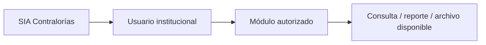

> [!NOTE]
> Para ejercicios públicos del curso se utilizarán únicamente archivos cuya consulta o utilización esté autorizada.

---

# 6. SIA Observa

**SIA Observa** es otra de las plataformas enlazadas oficialmente por la Contraloría General de Boyacá.

Está especialmente relacionada con información de contratación y seguimiento.

## ¿Qué podemos consultar?

Dependiendo del perfil autorizado, la plataforma puede contener información relacionada con:

- contratos;
- entidades;
- contratistas;
- valores;
- fechas;
- modalidades;
- información contractual reportada;
- documentos asociados.

## Acceso

[SIA Observa](https://siaobserva.auditoria.gov.co/Login.aspx?redirect=Inicio)

La Contraloría General de Boyacá también mantiene recursos de apoyo:

[Contraloría General de Boyacá — Rendición de cuentas y acceso a SIA](https://cgb.gov.co/inicio/rendicion-de-cuentas/)

## ¿Cómo obtenemos los datos?

El procedimiento depende del perfil habilitado:

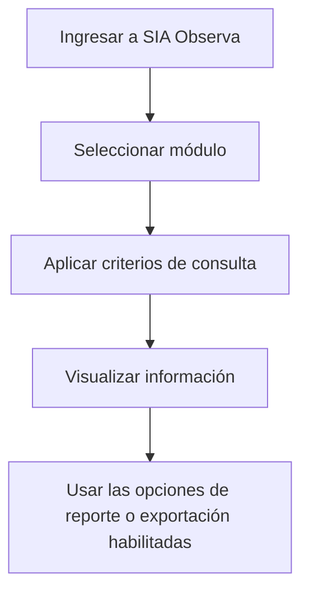

No debe suponerse que todo usuario puede descargar la totalidad de la base.

---

# 7. SECOP

El **Sistema Electrónico para la Contratación Pública — SECOP** es una de las fuentes más importantes cuando se requiere consultar información sobre contratación pública en Colombia.

La Agencia Nacional de Contratación Pública — **Colombia Compra Eficiente** publica información de SECOP como datos abiertos.

## ¿Qué información podemos encontrar?

Entre otros elementos:

- entidad compradora;
- NIT;
- departamento;
- municipio;
- proceso de contratación;
- descripción;
- modalidad;
- estado;
- fechas;
- valor;
- proveedor;
- contrato;
- información asociada con el proceso contractual.

---

# 8. SECOP II — Procesos de Contratación

Uno de los datasets oficiales más útiles es:

**SECOP II — Procesos de Contratación**

Contiene el registro de los procesos de compra realizados en SECOP II, sean o no adjudicados.

## Acceso

[SECOP II — Procesos de Contratación](https://www.datos.gov.co/w/p6dx-8zbt)

Identificador del conjunto:

```text
p6dx-8zbt
```

## ¿Cómo descargar datos?

### Opción 1 — Desde el navegador

1. Abra el dataset.
2. Revise sus columnas y descripción.
3. Abra las opciones de filtrado.
4. Defina los criterios deseados.
5. Utilice **Exportar**.
6. Seleccione el formato disponible, por ejemplo **CSV**.

Una consulta relacionada con Boyacá podría comenzar utilizando el campo:

```text
Departamento Entidad
```

y seleccionando:

```text
Boyacá
```

---

## Opción 2 — OData

Datos Abiertos Colombia ofrece un punto de acceso **OData** para muchos conjuntos.

OData permite conectar la fuente con aplicaciones compatibles sin tener que descargar manualmente un archivo cada vez.

El propio portal muestra el punto de acceso disponible desde la opción:

```text
Exportar
    ↓
OData
```

---

## Opción 3 — API

Los conjuntos publicados en Datos Abiertos Colombia cuentan con mecanismos de consulta mediante API.

El identificador:

```text
p6dx-8zbt
```

permite reconocer de forma única el dataset.

Una ruta básica de acceso a los datos en formato JSON es:

```text
https://www.datos.gov.co/resource/p6dx-8zbt.json
```

Y la misma fuente puede solicitarse en otros formatos admitidos por la plataforma.

> [!NOTE]
> En esta sesión únicamente es necesario reconocer que existe esta forma de acceso. No se requiere programar una consulta mediante API.

---

# 9. SECOP II — Contratos Electrónicos

Los **procesos de contratación** y los **contratos electrónicos** corresponden a conjuntos diferentes.

El dataset de contratos permite consultar información del contrato publicado electrónicamente en SECOP II.

## Acceso

[SECOP II — Contratos Electrónicos](https://www.datos.gov.co/Gastos-Gubernamentales/SECOP-II-Contratos-Electr-nicos/jbjy-vk9h)

Identificador:

```text
jbjy-vk9h
```

## Formas de acceso

Al igual que otros conjuntos de Datos Abiertos Colombia:

- consulta web;
- filtros;
- exportación;
- CSV;
- API;
- OData, cuando esté disponible en la ficha.

---

# 10. Colombia Compra Eficiente — Datos abiertos

Colombia Compra Eficiente mantiene una sección dedicada a los datos abiertos del Sistema de Compra Pública.

## ¿Qué encontramos?

Entre otros recursos:

- datos abiertos de SECOP;
- información de SECOP II;
- manuales;
- recursos relacionados con el estándar OCDS;
- archivos de descarga asociados con SECOP II;
- información sobre planes de pago y otros conjuntos.

## Acceso

[Colombia Compra Eficiente — Datos abiertos](https://operaciones.colombiacompra.gov.co/datos-abiertos)

[Colombia Compra Eficiente — SECOP II](https://www.colombiacompra.gov.co/archivos/app-datos-abiertos/secop-ii)

---

# 11. Datos Abiertos Colombia

**Datos Abiertos Colombia** es el portal nacional donde diferentes entidades públicas publican conjuntos de datos reutilizables.

## Acceso

[Datos Abiertos Colombia](https://www.datos.gov.co/)

## ¿Qué podemos encontrar?

El portal no está limitado a contratación.

Puede contener información relacionada con:

- presupuesto;
- contratación;
- educación;
- salud;
- ambiente;
- transporte;
- territorio;
- seguridad;
- entidades públicas;
- cultura;
- agricultura;
- infraestructura;
- trámites;
- estadísticas administrativas.

---

# 12. ¿Cómo buscar un dataset en Datos Abiertos Colombia?

## Paso 1

Ingrese a:

[https://www.datos.gov.co/](https://www.datos.gov.co/)

## Paso 2

Utilice palabras clave.

Ejemplos:

```text
Boyacá
contratación
presupuesto
municipios
deuda pública
inversión
hospitales
educación
```

## Paso 3

Antes de descargar, revise la ficha del conjunto.

Busque información como:

- nombre;
- entidad que suministra los datos;
- fecha de actualización;
- cobertura;
- descripción;
- columnas;
- tipo de cada columna.

## Paso 4

Utilice las opciones de descarga.

Dependiendo del conjunto, pueden encontrarse opciones como:

```text
CSV
CSV for Excel
JSON
RDF
XML
OData
API
```

Las opciones disponibles pueden variar según el dataset.

---

# 13. ¿Cómo reconocer un dataset de Datos Abiertos Colombia?

Cada conjunto tiene un identificador único de ocho caracteres, normalmente separado por un guion.

Ejemplos:

```text
p6dx-8zbt
jbjy-vk9h
```

Este identificador es muy importante porque permite localizar el recurso independientemente de su nombre visible.

Ejemplo:

```text
SECOP II - Procesos de Contratación
ID: p6dx-8zbt
```

---

# 14. CHIP

**CHIP** significa **Consolidador de Hacienda e Información Pública**.

Es administrado por la Contaduría General de la Nación y permite reunir información reportada por entidades públicas.

## Acceso

[CHIP — Consolidador de Hacienda e Información Pública](https://www.chip.gov.co/)

## ¿Qué información puede encontrarse?

Dependiendo de la entidad, categoría y periodo consultado, puede encontrarse información relacionada con:

- contabilidad pública;
- información financiera;
- presupuesto;
- categorías de reporte territorial;
- información del Sistema General de Regalías;
- información institucional reportada mediante categorías habilitadas.

---

# 15. CUIPO

**CUIPO** significa:

> Categoría Única de Información del Presupuesto Ordinario.

Se encuentra dentro del ecosistema de reporte de CHIP.

Es especialmente relevante para consultar información presupuestal reportada por entidades públicas.

## Acceso

[CHIP — Información y recursos CUIPO](https://www.chip.gov.co/inicio/apoyo/cuipo/1)

## ¿Qué encontramos en los recursos CUIPO?

El portal publica materiales como:

- listas de categorías;
- instructivos;
- protocolos de importación;
- recursos para entidades territoriales;
- información relacionada con los periodos de reporte.

---

# 16. ¿Cómo obtener información desde CHIP?

La lógica general es:

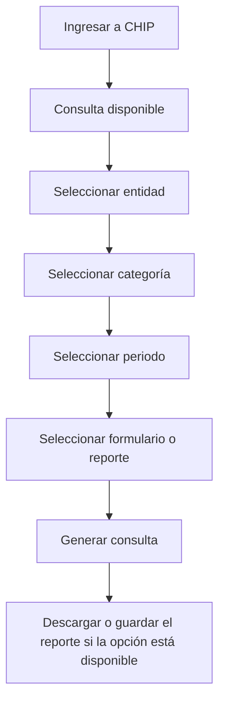

Los mecanismos y formatos de salida pueden variar según la categoría y el módulo utilizado.

## Datos que siempre deben registrarse durante una descarga

```text
Entidad:
Categoría:
Periodo:
Formulario:
Fecha de consulta:
```

En esta etapa no es necesario transformar la información: el objetivo es saber **de dónde se obtiene**.

---

# 17. DANE

El **Departamento Administrativo Nacional de Estadística — DANE** es la entidad responsable de producir y difundir buena parte de las estadísticas oficiales del país.

## Acceso general

[DANE](https://www.dane.gov.co/)

## Ejemplos de información disponible

- población;
- demografía;
- empleo;
- pobreza;
- precios;
- educación;
- economía;
- comercio;
- construcción;
- territorio;
- agricultura;
- censos;
- encuestas;
- proyecciones de población.

---

# 18. DANE no es una única base de datos

Dentro del ecosistema del DANE existen diferentes formas de obtener información.

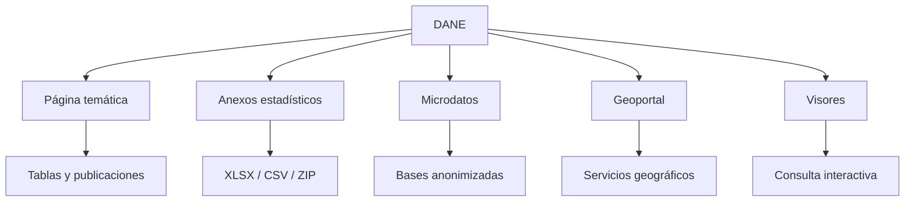

Por ello, cuando se requiere información del DANE es importante identificar primero **qué producto contiene el dato**.

---

# 19. Microdatos DANE

El **Catálogo Central de Datos** del DANE permite consultar metadatos y microdatos anonimizados de diferentes operaciones estadísticas.

## Acceso

[Microdatos DANE — Catálogo Central](https://microdatos.dane.gov.co/catalog/central)

## ¿Qué encontramos?

El catálogo organiza información en grandes áreas como:

- sociedad;
- economía;
- territorio.

Dentro del portal pueden encontrarse operaciones estadísticas relacionadas con:

- mercado laboral;
- pobreza;
- educación;
- comercio;
- agricultura;
- gobierno;
- construcción;
- demografía;
- condiciones de vida.

## ¿Cómo descargar?

1. Ingrese al catálogo.
2. Busque una operación estadística.
3. Seleccione la operación.
4. Consulte la documentación.
5. Abra la sección de **microdatos** o archivos de datos.
6. Descargue los archivos habilitados.

Los microdatos suelen publicarse en archivos comprimidos:

```text
.zip
```

que pueden contener una o varias bases.

También pueden encontrarse:

- documentación PDF;
- cuestionarios;
- diccionarios;
- metadatos DDI/XML;
- metadatos JSON.

---

# 20. DIVIPOLA

**DIVIPOLA** corresponde a la codificación de la división político-administrativa de Colombia.

Permite identificar de forma oficial:

- departamentos;
- municipios;
- centros poblados.

## ¿Por qué es importante como fuente?

Porque permite trabajar con códigos oficiales.

Ejemplo:

```text
15    → Boyacá
15001 → Tunja
15238 → Duitama
```

## Fuente

[Geoportal DANE](https://geoportal.dane.gov.co/)

El DANE dispone de servicios de DIVIPOLA dentro de su infraestructura geográfica.

---

# 21. Geoportal DANE

El Geoportal del DANE permite acceder a información estadística y geográfica.

## Acceso

[Geoportal DANE](https://geoportal.dane.gov.co/)

## ¿Qué podemos encontrar?

- límites departamentales;
- límites municipales;
- centros poblados;
- información del Marco Geoestadístico Nacional;
- servicios geográficos;
- geovisores.

## Servicio DIVIPOLA

El DANE mantiene servicios oficiales para consultar la DIVIPOLA.

Ejemplo de servicio vigente publicado para el Marco Geoestadístico Nacional:

[DIVIPOLA MGN — Servicios DANE](https://geoportal.dane.gov.co/mparcgis/rest/services/Divipola)

El servicio incluye capas como:

```text
Departamento
Municipio
Centros Poblados
```

---

# 22. ¿Se pueden obtener datos desde el Geoportal?

Sí.

Los servicios geográficos del DANE pueden admitir formatos como:

```text
JSON
GeoJSON
PBF
```

según el servicio consultado.

También pueden consumirse desde herramientas compatibles con servicios ArcGIS.

Para esta sesión es suficiente reconocer esta diferencia:

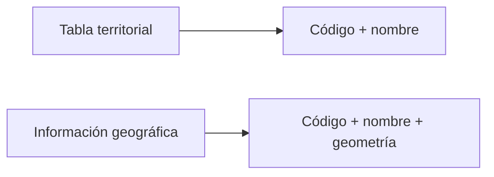

Una tabla responde:

> ¿Cuál es el código de Tunja?

Una fuente geográfica puede además representar:

> ¿Dónde está el municipio y cuál es su límite?

---

# 23. Visores DANE

El DANE también publica visores interactivos.

Un ejemplo es el visor de **Proyecciones de Población**.

## Acceso

[DANE — Visor de Proyecciones de Población](https://sitios.dane.gov.co/visor-de-proyecciones-de-poblacion/)

Los visores son útiles para consultar información rápidamente.

Sin embargo, debe recordarse:

> Visualizar un dato en una gráfica no es lo mismo que descargar el dataset que dio origen a esa gráfica.

Cuando se requieran archivos reutilizables, deben buscarse las opciones de descarga, anexos o microdatos asociados al producto estadístico.

---

# 24. TerriData — DNP

**TerriData** es una plataforma del Departamento Nacional de Planeación — DNP orientada a información territorial.

## Acceso

[TerriData](https://terridata.dnp.gov.co/)

## ¿Qué permite consultar?

Información de entidades territoriales en diferentes temáticas.

El portal dispone de secciones como:

- fichas;
- comparaciones;
- descargas;
- reportes.

## La sección más importante para obtener datasets

```text
Descargas
```

El propio portal permite **explorar y exportar bases de datos** desde esta sección.

---

# 25. ¿Cómo descargar desde TerriData?

1. Ingrese a TerriData.
2. Seleccione **Descargas**.
3. Explore las bases disponibles.
4. Seleccione la base de interés.
5. Seleccione las entidades territoriales requeridas.
6. Utilice la opción de exportación disponible.
7. Guarde el archivo obtenido.

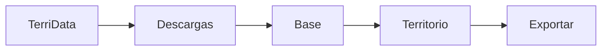

Para el contexto de este curso pueden resultar especialmente útiles los datos a nivel de:

```text
Boyacá
Municipios de Boyacá
```

---

# 26. MapaInversiones — DNP

**MapaInversiones** es una plataforma administrada por el Departamento Nacional de Planeación.

Permite consultar información relacionada con la inversión pública del país.

## Acceso

[MapaInversiones](https://mapainversiones.dnp.gov.co/)

## ¿Qué podemos encontrar?

Información asociada con proyectos de inversión pública, como:

- proyecto;
- ubicación;
- sector;
- entidad responsable;
- vigencia;
- estado;
- recursos;
- información básica del proyecto.

---

# 27. Reportes de MapaInversiones

MapaInversiones dispone de páginas para generar reportes aplicando criterios de consulta.

Por ejemplo, el reporte de **Datos Básicos** permite seleccionar:

- estado del proyecto;
- sector;
- entidad responsable;
- vigencia.

## Acceso

[MapaInversiones — Reporte de datos básicos](https://mapainversiones.dnp.gov.co/reportes/datosbasicos)

## Ruta de obtención

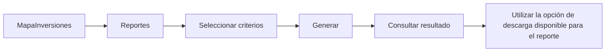

Las opciones concretas de descarga dependen del reporte disponible en el portal.

---

# 28. ¿Dónde busco según la información que necesito?

| Necesito información sobre... | Fuente inicial recomendada |
|---|---|
| Rendición de cuentas de sujetos de control | SIA Contralorías |
| Contratos reportados institucionalmente | SIA Observa |
| Procesos de contratación pública | SECOP II |
| Contratos electrónicos | SECOP II |
| Datos abiertos publicados por entidades | Datos Abiertos Colombia |
| Presupuesto reportado por entidades | CHIP / CUIPO |
| Población | DANE |
| Proyecciones de población | DANE |
| Códigos de municipios | DIVIPOLA |
| Límites geográficos | Geoportal DANE |
| Microdatos de encuestas oficiales | Microdatos DANE |
| Caracterización territorial | TerriData |
| Proyectos de inversión pública | MapaInversiones |
| Formatos de rendición en Boyacá | Contraloría General de Boyacá |

---

# 29. Fuentes para trabajar específicamente con Boyacá

Cuando la pregunta se relaciona con el departamento o con sus municipios, pueden utilizarse diferentes caminos.

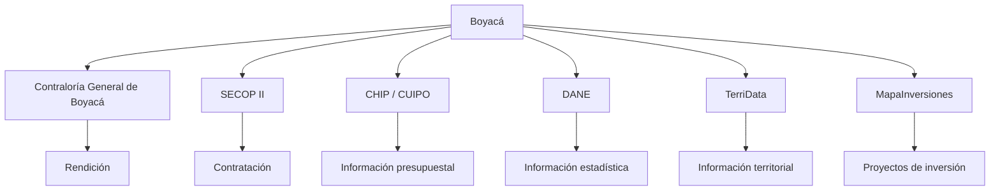

---

# 30. Ejemplo de ruta: buscar contratación de Boyacá

Para obtener un dataset público de contratación:

```text
Datos Abiertos Colombia
        ↓
SECOP II - Procesos de Contratación
        ↓
Filtrar "Departamento Entidad"
        ↓
Boyacá
        ↓
Exportar
        ↓
CSV
```

Fuente:

[SECOP II — Procesos de Contratación](https://www.datos.gov.co/w/p6dx-8zbt)

---

# 31. Ejemplo de ruta: buscar información territorial de un municipio

```text
TerriData
    ↓
Fichas o Descargas
    ↓
Seleccionar municipio
    ↓
Seleccionar información disponible
    ↓
Exportar
```

Fuente:

[TerriData](https://terridata.dnp.gov.co/)

---

# 32. Ejemplo de ruta: identificar oficialmente un municipio

```text
DANE
    ↓
DIVIPOLA
    ↓
Departamento: Boyacá
    ↓
Municipio
    ↓
Código oficial
```

Fuente:

[Geoportal DANE — DIVIPOLA](https://geoportal.dane.gov.co/mparcgis/rest/services/Divipola)

---

# 33. Ejemplo de ruta: consultar presupuesto reportado

```text
CHIP
    ↓
Consulta
    ↓
Entidad
    ↓
Categoría
    ↓
CUIPO u otra categoría disponible
    ↓
Periodo
    ↓
Formulario / reporte
```

Fuente:

[CHIP](https://www.chip.gov.co/)

---

# 34. Ejemplo de ruta: consultar un proyecto de inversión

```text
MapaInversiones
        ↓
Reportes
        ↓
Datos básicos
        ↓
Entidad / sector / vigencia
        ↓
Generar
```

Fuente:

[MapaInversiones — Datos básicos](https://mapainversiones.dnp.gov.co/reportes/datosbasicos)

---

# 35. Formatos que encontraremos

Durante la consulta de fuentes públicas pueden aparecer diferentes formatos.

| Formato | Extensión común | Uso general |
|---|---|---|
| Comma-Separated Values | `.csv` | Datos tabulares |
| Excel | `.xlsx` | Datos tabulares |
| JSON | `.json` | Datos estructurados |
| XML | `.xml` | Datos estructurados |
| GeoJSON | `.geojson` | Datos geográficos |
| ZIP | `.zip` | Archivo comprimido |
| PDF | `.pdf` | Reportes y documentación |

> [!NOTE]
> El hecho de que un portal publique un PDF no significa necesariamente que no exista también una base descargable.  
> Siempre conviene revisar las secciones de **datos**, **descargas**, **anexos**, **microdatos**, **exportar** o **API**.

---

# 36. ¿Qué significa API?

Una **API** es una forma de solicitar información directamente a un sistema mediante una dirección estructurada.

En un portal podemos trabajar de dos maneras:

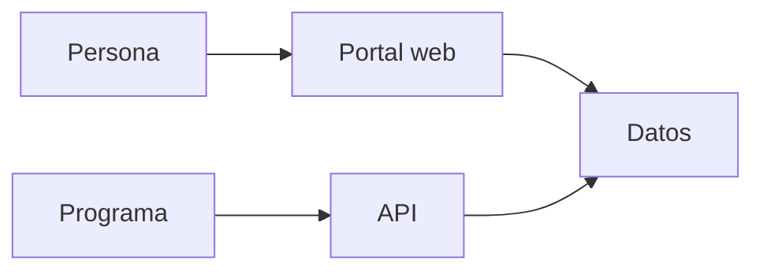

En esta sesión únicamente reconoceremos su existencia.

Ejemplo de un recurso público:

```text
https://www.datos.gov.co/resource/p6dx-8zbt.json
```

Este recurso corresponde al dataset:

```text
SECOP II - Procesos de Contratación
```

No es necesario utilizar programación para completar las actividades de esta sesión.

---

# 37. ¿Qué significa OData?

**OData** es un protocolo que permite que algunas herramientas se conecten directamente a una fuente de datos.

Datos Abiertos Colombia ofrece esta posibilidad en diferentes datasets.

Una ruta típica es:

```text
Dataset
   ↓
Exportar
   ↓
OData
   ↓
Copiar punto de acceso
```

Puede resultar útil cuando una aplicación compatible necesita conectarse directamente a la fuente.

En esta sesión solamente se identificará esta opción.

---

# 38. ¿Qué debemos observar antes de descargar?

Antes de presionar **Descargar** o **Exportar**, revise:

- nombre del conjunto;
- entidad que lo publica;
- descripción;
- cobertura geográfica;
- periodo;
- fecha de actualización;
- columnas disponibles;
- formato de descarga.

## Ficha rápida

```text
Fuente:
Entidad responsable:
Nombre del dataset:
Cobertura:
Periodo:
Fecha de actualización:
Formato disponible:
Enlace:
```

---

# 39. Fuentes internacionales

Las fuentes nacionales serán las principales durante el curso.

También es útil conocer algunos portales internacionales porque permiten consultar información comparable, estándares y conjuntos de datos públicos.

---

# 40. Open Contracting Data Standard — OCDS

El **Open Contracting Data Standard — OCDS** es un estándar internacional para publicar información estructurada sobre contratación pública.

## Acceso

[Open Contracting Data Standard — Español](https://standard.open-contracting.org/latest/es/)

## ¿Por qué aparece en este mapa?

Porque diferentes plataformas de contratación pública pueden publicar información utilizando una estructura común.

OCDS permite representar etapas como:

```text
Planeación
Licitación
Adjudicación
Contrato
Implementación
```

Colombia Compra Eficiente mantiene recursos relacionados con datos abiertos de contratación en estándares OCDS/EDCA.

[Colombia Compra Eficiente — Datos abiertos](https://operaciones.colombiacompra.gov.co/datos-abiertos)

---

# 41. Banco Mundial — Open Data

El Banco Mundial dispone de un portal abierto de indicadores.

## Acceso

[World Bank Open Data](https://data.worldbank.org/)

## Temas disponibles

Entre muchos otros:

- población;
- economía;
- educación;
- salud;
- desarrollo;
- ambiente;
- infraestructura.

## Formas de obtención

Dependiendo del recurso:

- descarga;
- CSV;
- Excel;
- API.

---

# 42. OECD Data Explorer

La Organización para la Cooperación y el Desarrollo Económicos — OCDE dispone de un explorador de datos.

## Acceso

[OECD Data Explorer](https://data-explorer.oecd.org/)

## ¿Qué encontramos?

Estadísticas comparables entre países en temas como:

- gobierno;
- economía;
- finanzas públicas;
- población;
- educación;
- empleo;
- desarrollo.

El portal permite seleccionar variables y exportar la información disponible.

---

# 43. Banco Interamericano de Desarrollo — Datos

El Banco Interamericano de Desarrollo dispone de recursos de datos para América Latina y el Caribe.

## Acceso

[BID — Data](https://data.iadb.org/)

Dependiendo del conjunto pueden encontrarse opciones para consulta y descarga.

---

# 44. Fuente nacional o fuente internacional

Para trabajar sobre una entidad pública de Boyacá, normalmente la ruta inicial será una **fuente oficial colombiana**.

Las fuentes internacionales sirven principalmente cuando se necesita:

- conocer un estándar;
- encontrar información de contexto internacional;
- consultar datos comparables entre países.

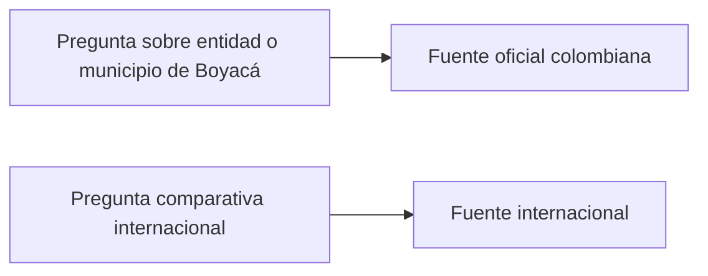

---

# 45. Actividad — Construya su mapa personal de fuentes

Seleccione cinco tipos de información que aparezcan con frecuencia en su trabajo.

Complete la tabla.

| Información que necesito | Fuente que utilizaría | ¿Cómo ingreso? | ¿Puedo descargar? | Formato disponible |
|---|---|---|---|---|
| | | | | |
| | | | | |
| | | | | |
| | | | | |
| | | | | |

---

# 46. Actividad — Encuentre un dataset

Seleccione una de las siguientes fuentes:

- Datos Abiertos Colombia;
- SECOP II;
- DANE;
- TerriData;
- MapaInversiones.

Localice un recurso que tenga relación con la gestión pública.

Registre:

```text
Nombre de la fuente:

Entidad responsable:

Nombre del dataset o reporte:

Enlace:

Cobertura geográfica:

Periodo:

Fecha de actualización:

¿Se puede descargar?:

Formato disponible:
```

No es necesario realizar ningún análisis con los datos.

---

# 47. Actividad — Fuentes para Boyacá

Complete las siguientes rutas.

## Contratación

```text
Fuente:
Dataset:
Filtro territorial disponible:
Forma de descarga:
```

## Presupuesto

```text
Fuente:
Categoría:
Periodo consultable:
Forma de obtención:
```

## Población

```text
Fuente:
Producto:
Nivel territorial:
Forma de obtención:
```

## División territorial

```text
Fuente:
Código utilizado:
Forma de obtención:
```

## Inversión pública

```text
Fuente:
Reporte:
Filtros disponibles:
Forma de obtención:
```

---

# 48. Guía rápida de navegación

## Si necesito contratación

➡️ **SECOP II / Datos Abiertos Colombia**

[Ir a SECOP II — Procesos](https://www.datos.gov.co/w/p6dx-8zbt)

---

## Si necesito información rendida a la Contraloría

➡️ **SIA Contralorías**

[Ir a la sección de Rendición de Cuentas de la CGB](https://cgb.gov.co/inicio/rendicion-de-cuentas/)

---

## Si necesito información de contratación reportada en SIA

➡️ **SIA Observa**

[Ir a SIA Observa](https://siaobserva.auditoria.gov.co/Login.aspx?redirect=Inicio)

---

## Si necesito información presupuestal reportada

➡️ **CHIP / CUIPO**

[Ir a CHIP](https://www.chip.gov.co/)

---

## Si necesito población o estadísticas oficiales

➡️ **DANE**

[Ir al DANE](https://www.dane.gov.co/)

---

## Si necesito códigos territoriales

➡️ **DIVIPOLA / Geoportal DANE**

[Ir a los servicios DIVIPOLA](https://geoportal.dane.gov.co/mparcgis/rest/services/Divipola)

---

## Si necesito bases de encuestas oficiales

➡️ **Microdatos DANE**

[Ir al Catálogo Central](https://microdatos.dane.gov.co/catalog/central)

---

## Si necesito información territorial organizada

➡️ **TerriData**

[Ir a TerriData](https://terridata.dnp.gov.co/)

---

## Si necesito proyectos de inversión pública

➡️ **MapaInversiones**

[Ir a MapaInversiones](https://mapainversiones.dnp.gov.co/)

---

## Si necesito buscar otros datos públicos

➡️ **Datos Abiertos Colombia**

[Ir a Datos Abiertos Colombia](https://www.datos.gov.co/)

---

# 49. Mapa final de consulta

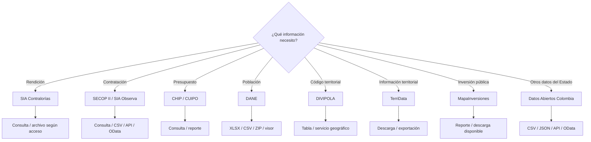

---

# 50. Directorio de enlaces

## Contraloría General de Boyacá

- [Rendición de cuentas](https://cgb.gov.co/inicio/rendicion-de-cuentas/)
- [Datos abiertos](https://cgb.gov.co/inicio/participacion-ciudadana/datos-abiertos/)
- [Sitio principal](https://cgb.gov.co/)

## SIA

- [SIA Contralorías](https://siacontralorias.auditoria.gov.co/)
- [SIA Observa](https://siaobserva.auditoria.gov.co/Login.aspx?redirect=Inicio)

## Contratación pública

- [Colombia Compra Eficiente — Datos abiertos](https://operaciones.colombiacompra.gov.co/datos-abiertos)
- [SECOP II — Procesos de Contratación](https://www.datos.gov.co/w/p6dx-8zbt)
- [SECOP II — Contratos Electrónicos](https://www.datos.gov.co/Gastos-Gubernamentales/SECOP-II-Contratos-Electr-nicos/jbjy-vk9h)
- [Colombia Compra Eficiente — SECOP II](https://www.colombiacompra.gov.co/archivos/app-datos-abiertos/secop-ii)

## Datos abiertos

- [Datos Abiertos Colombia](https://www.datos.gov.co/)

## Información financiera y presupuestal

- [CHIP](https://www.chip.gov.co/)
- [CHIP — CUIPO](https://www.chip.gov.co/inicio/apoyo/cuipo/1)

## Estadística y territorio

- [DANE](https://www.dane.gov.co/)
- [Microdatos DANE](https://microdatos.dane.gov.co/catalog/central)
- [Geoportal DANE](https://geoportal.dane.gov.co/)
- [Servicios DIVIPOLA](https://geoportal.dane.gov.co/mparcgis/rest/services/Divipola)
- [Proyecciones de Población](https://sitios.dane.gov.co/visor-de-proyecciones-de-poblacion/)

## Departamento Nacional de Planeación

- [TerriData](https://terridata.dnp.gov.co/)
- [MapaInversiones](https://mapainversiones.dnp.gov.co/)
- [MapaInversiones — Reportes](https://mapainversiones.dnp.gov.co/reportes/datosbasicos)

## Fuentes internacionales

- [Open Contracting Data Standard](https://standard.open-contracting.org/latest/es/)
- [World Bank Open Data](https://data.worldbank.org/)
- [OECD Data Explorer](https://data-explorer.oecd.org/)
- [BID Data](https://data.iadb.org/)

---

# 51. Idea central

```text
No todos los datos del Estado están en una única plataforma.

La clave es saber:

1. qué información necesito;
2. qué entidad la produce;
3. en qué sistema se publica;
4. cómo puedo consultarla;
5. cómo puedo obtenerla en un formato reutilizable.
```

El primer paso de cualquier trabajo con datos públicos es **encontrar la fuente correcta**.
