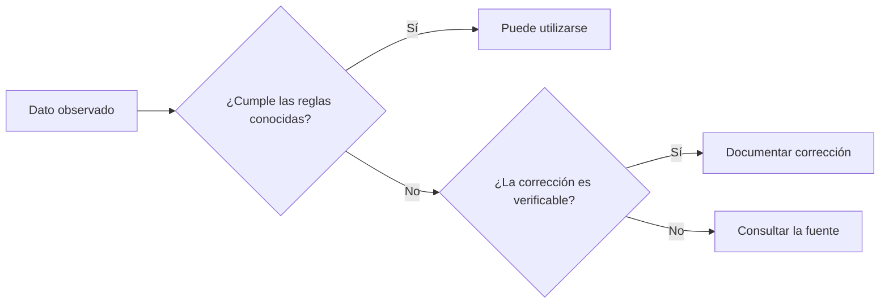

# Ejercicio de calidad de datos — Datos sucios

**Curso:** Analítica de Datos e Inteligencia Artificial para la Gestión Pública  
**Entidad:** Contraloría General de Boyacá  
**Sesión 1:** Datos e información para la toma de decisiones  
**Actividad:** Calidad de datos

---

## Propósito

En esta actividad se trabajará con un conjunto de datos deliberadamente construido con errores frecuentes que pueden aparecer en archivos administrativos.

El objetivo es **identificar problemas de calidad antes de utilizar los datos**.

> [!IMPORTANT]
> Todos los registros y valores monetarios de este ejercicio son **ficticios** y fueron creados únicamente con fines académicos.  
> No representan información oficial ni hallazgos relacionados con ninguna entidad territorial.

---

# 1. Contexto del ejercicio

Se recibió un archivo que supuestamente consolida información presupuestal reportada por diferentes entidades territoriales.

Cada fila debería representar un registro con los siguientes datos:

- municipio;
- código territorial;
- NIT de la entidad;
- vigencia;
- presupuesto definitivo;
- valor comprometido;
- fecha de reporte;
- fuente del dato.

Sin embargo, antes de utilizar el archivo es necesario revisar su calidad.

La pregunta de esta actividad es:

> **¿Podemos confiar en estos datos tal como fueron recibidos?**

---

# 2. Dataset

Copie el siguiente contenido en un archivo llamado:

```text
03_datos_sucios.csv
```

Utilice codificación UTF-8.

```csv
id,municipio,codigo_divipola,nit_entidad,vigencia,presupuesto_definitivo,valor_comprometido,fecha_reporte,fuente
1,Tunja,15001,891800846-1,2025,125000000000,98750000000,2025-12-31,SIA
2,TUNJA,15001,8918008461,2025,125000000000,98750000000,31/12/2025,SIA
3,tunja,15001,891800846-1,2025,"$125.000.000.000","$98.750.000.000",2025/12/31,SIA
4,Tunja ,15001,891800846-1,25,125000000000,98750000000,2025-12-31,sia
5,Duitama,15238,891855138-1,2025,98000000000,75500000000,2025-12-31,SIA
6,Duitamá,15238,8918551381,2025,98000000000,75500000000,31-12-2025,SIA
7,DUITAMA,15238,,2025,98000000000,75500000000,2025-12-31,SIA
8,Duitama,15283,891855138-1,2025,98000000000,75500000000,2025-12-31,SIA
9,Sogamoso,15759,891855130-2,2025,145000000000,120500000000,2025-12-31,SIA
10,SOGAMOSO,15759,891855130-2,2025,145000000000,120500000000,2025-12-31,SIA
11,Sogamoso,15759,891855130-2,2025,145000000000,,2025-12-31,SIA
12,Sogamoso,15759,891855130-2,2025,-145000000000,120500000000,2025-12-31,SIA
13,Chiquinquirá,15176,891801234-5,2025,87000000000,69000000000,2025-12-31,SIA
14,Chiquinquira,15176,891801234-5,2025,87000000000,69000000000,2025-12-31,SIA
15,CHIQUINQUIRÁ,15176,891801234-5,2025,87000000000,91000000000,2025-12-31,SIA
16,Chiquinquirá,,891801234-5,2025,87000000000,69000000000,2025-12-31,SIA
17,Paipa,15516,891802345-6,2025,76000000000,54000000000,2025-12-31,SIA
18,PAIPA,15516,891802345-6,2025,76000000000,54000000000,2025-13-31,SIA
19,Paipa,15516,891802345-6,2025,76000000000,54000000000,,SIA
20,Paipa,15516,891802345-6,2025,"76,000,000,000","54,000,000,000",2025-12-31,SIA
21,Puerto Boyacá,15572,891803456-7,2025,112000000000,84500000000,2025-12-31,SIA
22,Puerto Boyaca,15572,891803456-7,2025,112000000000,84500000000,2025-12-31,SIA 
23,PUERTO BOYACÁ,15572,891803456-7,2024,112000000000,84500000000,2025-12-31,SIA
24,Puerto Boyacá,15572,N/A,2025,112000000000,84500000000,2025-12-31,SIA
25,Villa de Leyva,15407,891804567-8,2025,68000000000,47200000000,2025-12-31,SIA
26,Villa De Leyva,15407,891804567-8,2025,68000000000,47200000000,2025-12-31,SIA
27,VILLA DE LEYVA,15407,891804567-8,2025,68000000000,47200000000,31 diciembre 2025,SIA
28,Villa de Leyva,15407,891804567-8,2025,68000000000,47200000000,2025-12-31,SECOP
29,Moniquirá,15469,891805678-9,2025,59000000000,38900000000,2025-12-31,SIA
30,Moniquira,15469,891805678-9,2025,59000000000,38900000000,2025-12-31,SIA
31,Moniquirá,15469,891805678-9,2025,59000000000,38900000000,2025-12-31,SIA
32,Garagoa,15299,891806789-0,2025,51000000000,33800000000,2025-12-31,SIA
33,GARAGOA,15299,8918067890,2025,51000000000,33800000000,2025-12-31,SIA
34,Garagoa,15299,891806789-0,2025,,33800000000,2025-12-31,SIA
35,Soatá,15753,891807890-1,2025,46000000000,31200000000,2025-12-31,SIA
36,Soata,15753,891807890-1,2025,46000000000,31200000000,2025-12-31,SIA
37,Soatá,15753,891807890-1,2025,46000000000,31200000000,2025-12-31,null
38,Soatá,15753,891807890-1,2025,46000000000,31200000000,31/02/2025,SIA
39,Tunja,15001,891800846-1,2025,125000000000,98750000000,2025-12-31,SIA
40, Duitama,15238,891855138-1,2025,98000000000,75500000000,2025-12-31,SIA
```

---

# 3. Primera inspección

Antes de modificar cualquier valor, observe el archivo completo.

No corrija todavía los datos.

Responda:

### ¿Cuántos registros contiene el archivo?

**Respuesta:**

---

### ¿Cuántas columnas contiene?

**Respuesta:**

---

### ¿Qué representa una fila?

**Respuesta:**

---

### ¿Qué columnas deberían contener texto?

**Respuesta:**

---

### ¿Qué columnas deberían contener números?

**Respuesta:**

---

### ¿Qué columna debería contener una fecha?

**Respuesta:**

---

# 4. Busque problemas de completitud

La **completitud** permite identificar datos que deberían existir pero están ausentes.

Busque registros que presenten:

- celdas vacías;
- valores como `N/A`;
- valores como `null`;
- campos obligatorios sin información.

Complete:

| ID | Campo con problema | Valor encontrado | ¿Por qué requiere revisión? |
|---:|---|---|---|
| | | | |
| | | | |
| | | | |
| | | | |

---

# 5. Busque problemas de consistencia

Un mismo dato puede aparecer escrito de diferentes maneras.

Busque ejemplos relacionados con:

- mayúsculas y minúsculas;
- tildes;
- espacios adicionales;
- diferentes representaciones del NIT;
- diferentes nombres para una misma fuente;
- diferentes formatos de fecha.

Complete:

| ID | Campo | Valor encontrado | Otro valor que parece representar lo mismo |
|---:|---|---|---|
| | | | |
| | | | |
| | | | |
| | | | |
| | | | |

---

# 6. Busque posibles duplicados

Un archivo puede contener varias filas que representen el mismo registro.

Busque registros:

- completamente idénticos;
- casi idénticos;
- que parezcan duplicados después de estandarizar texto o formatos.

Complete:

| ID 1 | ID 2 | ¿Por qué podrían ser duplicados? |
|---:|---:|---|
| | | |
| | | |
| | | |

> [!NOTE]
> Dos filas similares no deben eliminarse automáticamente.  
> Primero debe verificarse si realmente representan el mismo hecho.

---

# 7. Busque problemas de validez

La **validez** pregunta si un valor cumple las reglas esperadas para ese campo.

Revise:

- años con formatos diferentes;
- fechas imposibles;
- códigos con una cantidad inesperada de dígitos;
- valores monetarios negativos;
- texto almacenado en una columna que debería ser numérica;
- identificadores incompletos.

Complete:

| ID | Campo | Valor | Regla que parece incumplir |
|---:|---|---|---|
| | | | |
| | | | |
| | | | |
| | | | |
| | | | |

---

# 8. Busque valores que requieren verificación

Algunos valores pueden estar correctamente escritos y aun así requerir revisión.

Ejemplo:

```text
presupuesto_definitivo = 87.000.000.000
valor_comprometido     = 91.000.000.000
```

La tarea no consiste en afirmar inmediatamente que el dato es incorrecto.

La pregunta correcta es:

> **¿Este valor puede explicarse con la información disponible o requiere una verificación adicional?**

Identifique al menos tres casos.

| ID | Dato que requiere revisión | Pregunta que formularía antes de usarlo |
|---:|---|---|
| | | |
| | | |
| | | |

---

# 9. Revise las fechas

Observe la columna:

```text
fecha_reporte
```

Identifique todos los formatos diferentes utilizados.

Complete:

```text
Formato 1:

Formato 2:

Formato 3:

Formato 4:

Otros:
```

Luego responda:

### ¿Qué formato debería utilizarse de manera uniforme?

**Respuesta:**

---

# 10. Revise los valores monetarios

Observe:

```text
presupuesto_definitivo
valor_comprometido
```

Busque diferencias como:

```text
125000000000
$125.000.000.000
76,000,000,000
```

Responda:

### ¿Representan todos estos valores el mismo tipo de dato?

**Respuesta:**

### ¿Qué dificultad producirían al intentar realizar operaciones matemáticas?

**Respuesta:**

### ¿Cómo deberían almacenarse para facilitar su procesamiento?

**Respuesta:**

---

# 11. Revise los nombres de municipios

Busque variantes como:

```text
Tunja
TUNJA
tunja
Tunja 
```

y:

```text
Duitama
Duitamá
DUITAMA
 Duitama
```

Responda:

### ¿Cuántos nombres diferentes parecen representar realmente el mismo municipio?

**Respuesta:**

### ¿Por qué una diferencia pequeña en el texto puede generar problemas?

**Respuesta:**

---

# 12. Revise los códigos territoriales

Compare:

```text
municipio
codigo_divipola
```

La existencia de un código territorial permite representar un municipio mediante un identificador más estable que su nombre.

Busque registros donde:

- el código esté vacío;
- el código parezca diferente para municipios que deberían ser iguales;
- el nombre cambie, pero el código permanezca igual.

Complete:

| ID | Municipio | Código observado | ¿Qué debería verificarse? |
|---:|---|---|---|
| | | | |
| | | | |
| | | | |

---

# 13. Revise el campo fuente

Observe la columna:

```text
fuente
```

Responda:

### ¿Todos los registros utilizan el mismo nombre para la fuente?

**Respuesta:**

### ¿Existen espacios adicionales?

**Respuesta:**

### ¿Hay valores vacíos o equivalentes a ausencia de información?

**Respuesta:**

### ¿Existe algún registro cuya fuente sea diferente al resto y requiera confirmar si pertenece al mismo conjunto?

**Respuesta:**

---

# 14. Clasifique los problemas encontrados

Utilice las siguientes categorías:

- **Completitud**
- **Consistencia**
- **Validez**
- **Unicidad**
- **Exactitud por verificar**

Complete por lo menos diez registros.

| ID | Problema encontrado | Categoría | Acción que propondría |
|---:|---|---|---|
| | | | |
| | | | |
| | | | |
| | | | |
| | | | |
| | | | |
| | | | |
| | | | |
| | | | |
| | | | |

---

# 15. No todos los errores se corrigen de la misma manera

Clasifique cada situación.

## Situación A

```text
municipio = "TUNJA"
```

¿Puede estandarizarse directamente?

- [ ] Sí
- [ ] No
- [ ] Requiere verificación

Explique:

---

## Situación B

```text
codigo_divipola = vacío
```

¿Puede inventarse el código?

- [ ] Sí
- [ ] No

Explique:

---

## Situación C

```text
fecha_reporte = 31/02/2025
```

¿Puede reemplazarse automáticamente por otra fecha?

- [ ] Sí
- [ ] No
- [ ] Requiere consultar la fuente

Explique:

---

## Situación D

```text
valor_comprometido > presupuesto_definitivo
```

¿Debe cambiarse el valor para que sea menor?

- [ ] Sí
- [ ] No
- [ ] Requiere verificación

Explique:

---

## Situación E

```text
NIT = 8918551381
```

y en otra fila:

```text
NIT = 891855138-1
```

¿Puede concluirse solamente observando el archivo que ambos valores deben quedar iguales?

- [ ] Sí
- [ ] No
- [ ] Requiere verificación

Explique:

---

# 16. Semáforo de calidad

Después de revisar el archivo, asigne un estado a cada dimensión.

Utilice:

```text
🟢 Adecuado
🟡 Requiere revisión
🔴 Presenta problemas importantes
```

| Dimensión | Estado | Justificación |
|---|---|---|
| Completitud | | |
| Consistencia | | |
| Validez | | |
| Unicidad | | |
| Exactitud por verificar | | |

---

# 17. Preguntas de cierre

Responda en grupo.

### 1. ¿Utilizaría este archivo inmediatamente para elaborar un informe?

**Respuesta:**

---

### 2. ¿Qué problema considera más riesgoso?

**Respuesta:**

---

### 3. ¿Qué problemas pueden corregirse mediante una regla de formato?

**Respuesta:**

---

### 4. ¿Qué problemas requieren consultar nuevamente la fuente?

**Respuesta:**

---

### 5. ¿Qué problemas podrían hacer que un mismo municipio aparezca varias veces en un resumen?

**Respuesta:**

---

### 6. ¿Qué problemas impedirían realizar correctamente una operación matemática?

**Respuesta:**

---

### 7. ¿Qué información nunca debería inventarse durante una corrección?

**Respuesta:**

---

# 18. Entregable de la actividad

El grupo debe entregar una tabla con por lo menos **10 problemas de calidad identificados**.

Formato:

| ID | Campo | Valor observado | Tipo de problema | ¿Puede corregirse directamente? | ¿Requiere verificar fuente? |
|---:|---|---|---|---|---|
| | | | | | |
| | | | | | |
| | | | | | |
| | | | | | |
| | | | | | |
| | | | | | |
| | | | | | |
| | | | | | |
| | | | | | |
| | | | | | |

---

# 19. Regla de trabajo

> **Encontrar un dato extraño no significa demostrar que el dato sea incorrecto.**

Durante una revisión pueden existir tres situaciones:



La calidad de los datos no consiste únicamente en modificar valores.

También implica reconocer cuándo **no tenemos información suficiente para corregirlos**.
