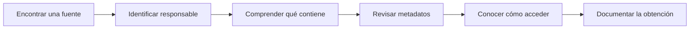

# Ficha para evaluar una fuente de datos

**Curso:** Analítica de Datos e Inteligencia Artificial para la Gestión Pública  
**Entidad:** Contraloría General de Boyacá  
**Sesión 1:** Datos e información para la toma de decisiones  
**Actividad:** Evaluación de fuentes de información

---

## Propósito

Antes de utilizar información proveniente de una página web, un sistema institucional, un portal de datos abiertos o un archivo descargado, es necesario conocer **qué es la fuente, quién la administra, qué información contiene y qué tan adecuada resulta para el propósito del análisis**.

Esta ficha permite documentar de manera ordenada una fuente de información.

> [!IMPORTANT]
> Una fuente oficial no debe utilizarse únicamente porque “aparece en una página del Estado”.  
> También es necesario conocer su responsable, cobertura, fecha de actualización, periodicidad, alcance y forma de obtención.

---

# 1. Identificación de la fuente

## Nombre de la fuente

```text

```

## Entidad responsable

```text

```

## Entidad que publica la información

Si es diferente de la entidad responsable:

```text

```

## Dirección web

```text

```

## Fecha de consulta

```text

```

## Nombre del conjunto de datos, reporte, módulo o sección consultada

```text

```

---

# 2. Tipo de fuente

Seleccione la opción que mejor corresponda.

- [ ] Sistema institucional
- [ ] Portal de datos abiertos
- [ ] Portal estadístico
- [ ] Portal de consulta
- [ ] Dataset
- [ ] Reporte
- [ ] Archivo descargable
- [ ] API
- [ ] Servicio geográfico
- [ ] Visor
- [ ] Otro

### Otro:

```text

```

---

# 3. Tema principal

¿Sobre qué tipo de información trata la fuente?

- [ ] Contratación pública
- [ ] Presupuesto
- [ ] Contabilidad
- [ ] Finanzas públicas
- [ ] Deuda pública
- [ ] Inversión pública
- [ ] Población
- [ ] Información territorial
- [ ] Educación
- [ ] Salud
- [ ] Infraestructura
- [ ] Ambiente
- [ ] Regalías
- [ ] Rendición de cuentas
- [ ] Gestión institucional
- [ ] Otro

### Otro:

```text

```

---

# 4. Descripción de la fuente

Explique brevemente qué información contiene.

```text


```

---

# 5. ¿Qué pregunta podría responder esta fuente?

Escriba una pregunta concreta.

Ejemplo:

```text
¿Qué procesos de contratación fueron publicados por una entidad durante una vigencia determinada?
```

Pregunta:

```text


```

---

# 6. Unidad de observación

La unidad de observación indica **qué representa una fila, registro, ficha o elemento dentro de la fuente**.

Ejemplos:

```text
Un contrato
Un proceso de contratación
Un municipio
Una entidad
Un proyecto de inversión
Un periodo presupuestal
Una persona anonimizada
```

### Unidad de observación identificada

```text

```

---

# 7. Cobertura geográfica

Seleccione el nivel disponible.

- [ ] Nacional
- [ ] Departamental
- [ ] Municipal
- [ ] Entidad
- [ ] Proyecto
- [ ] Contrato
- [ ] Otro

### Cobertura específica

Ejemplo:

```text
Colombia
Boyacá
Municipios de Boyacá
```

```text

```

---

# 8. Cobertura temporal

## Año inicial disponible

```text

```

## Año final disponible

```text

```

## Periodo consultado

```text

```

## ¿La fuente contiene información histórica?

- [ ] Sí
- [ ] No
- [ ] No fue posible determinarlo

---

# 9. Fecha de actualización

## Última actualización visible

```text

```

## ¿La fecha de actualización está claramente indicada?

- [ ] Sí
- [ ] No

## Observaciones

```text

```

---

# 10. Periodicidad

¿Con qué frecuencia se actualiza la información?

- [ ] En tiempo cercano al registro
- [ ] Diaria
- [ ] Semanal
- [ ] Mensual
- [ ] Trimestral
- [ ] Semestral
- [ ] Anual
- [ ] Por vigencia
- [ ] Eventual
- [ ] No identificada
- [ ] Otra

### Otra:

```text

```

---

# 11. Forma de acceso

¿Cómo se accede a la información?

- [ ] Acceso público sin registro
- [ ] Acceso público con registro
- [ ] Usuario institucional
- [ ] Usuario y contraseña
- [ ] Perfil autorizado
- [ ] Solicitud previa
- [ ] Otro

### Observaciones

```text

```

---

# 12. ¿Cómo se obtiene la información?

Marque todas las opciones disponibles.

- [ ] Consulta en pantalla
- [ ] Descarga directa
- [ ] Exportación después de aplicar filtros
- [ ] Reporte generado
- [ ] CSV
- [ ] XLSX
- [ ] JSON
- [ ] XML
- [ ] GeoJSON
- [ ] ZIP
- [ ] PDF
- [ ] API
- [ ] OData
- [ ] Servicio geográfico
- [ ] Otro

### Otro:

```text

```

---

# 13. Ruta utilizada para obtener los datos

Describa los pasos utilizados.

Ejemplo:

```text
Datos Abiertos Colombia
        ↓
SECOP II - Procesos de Contratación
        ↓
Filtro: Departamento Entidad = Boyacá
        ↓
Exportar
        ↓
CSV
```

### Ruta

```text


```

---

# 14. Filtros utilizados

Registre todos los filtros aplicados antes de obtener la información.

| Campo | Valor utilizado |
|---|---|
| | |
| | |
| | |
| | |
| | |

---

# 15. Archivo obtenido

## Nombre original del archivo

```text

```

## Formato

```text

```

## Tamaño aproximado

```text

```

## Número de registros

Si es visible o puede determinarse fácilmente:

```text

```

## Número de columnas

```text

```

---

# 16. Variables principales

Registre las variables más importantes encontradas.

| Variable | Significado |
|---|---|
| | |
| | |
| | |
| | |
| | |
| | |
| | |
| | |

---

# 17. Identificadores disponibles

Identifique si la fuente incluye campos que permitan reconocer de manera única entidades, territorios, contratos o registros.

Ejemplos:

```text
NIT
Código DIVIPOLA
ID del proceso
ID del contrato
Código BPIN
Código de entidad
```

### Identificadores encontrados

```text


```

---

# 18. ¿Existe documentación?

Revise si la fuente cuenta con documentación complementaria.

- [ ] Diccionario de datos
- [ ] Descripción de columnas
- [ ] Manual de usuario
- [ ] Metadatos
- [ ] Ficha técnica
- [ ] Metodología
- [ ] Preguntas frecuentes
- [ ] Tutorial
- [ ] No se encontró documentación
- [ ] Otro

### Enlaces o referencias

```text


```

---

# 19. ¿Quién produce el dato?

No siempre quien publica la información es quien la produce.

## Productor identificado

```text

```

## Publicador identificado

```text

```

## ¿Son la misma entidad?

- [ ] Sí
- [ ] No
- [ ] No fue posible determinarlo

---

# 20. Nivel de oficialidad

Clasifique la fuente según lo observado.

- [ ] Fuente oficial primaria
- [ ] Fuente oficial que consolida información de otras entidades
- [ ] Fuente oficial de consulta
- [ ] Fuente secundaria
- [ ] No fue posible determinarlo

## Justificación

```text


```

---

# 21. ¿La información puede descargarse directamente?

- [ ] Sí
- [ ] No
- [ ] Parcialmente
- [ ] Depende del perfil de usuario

## Explique

```text


```

---

# 22. ¿Los datos están estructurados?

Seleccione la opción predominante.

- [ ] Datos estructurados
- [ ] Datos semiestructurados
- [ ] Datos no estructurados
- [ ] Mezcla de varios tipos

## Ejemplos encontrados

```text


```

---

# 23. ¿Qué formatos están disponibles?

| Formato | Disponible |
|---|:---:|
| CSV | [ ] |
| XLSX | [ ] |
| JSON | [ ] |
| XML | [ ] |
| GeoJSON | [ ] |
| ZIP | [ ] |
| PDF | [ ] |
| API | [ ] |
| OData | [ ] |
| Servicio geográfico | [ ] |

---

# 24. Metadatos disponibles

¿La fuente permite conocer claramente los siguientes elementos?

| Elemento | Sí | No | Observación |
|---|:---:|:---:|---|
| Entidad responsable | [ ] | [ ] | |
| Descripción | [ ] | [ ] | |
| Fecha de actualización | [ ] | [ ] | |
| Periodo de cobertura | [ ] | [ ] | |
| Cobertura territorial | [ ] | [ ] | |
| Definición de variables | [ ] | [ ] | |
| Unidad de medida | [ ] | [ ] | |
| Frecuencia de actualización | [ ] | [ ] | |
| Identificadores | [ ] | [ ] | |

---

# 25. Claridad de las variables

Revise los nombres de las columnas o campos.

## ¿Los nombres permiten comprender fácilmente qué representa cada dato?

- [ ] Sí
- [ ] Parcialmente
- [ ] No

## Ejemplo de una variable clara

```text

```

## Ejemplo de una variable que requiere consultar documentación

```text

```

---

# 26. Unidad de medida

¿La fuente indica claramente las unidades utilizadas?

Ejemplos:

```text
Pesos
Miles de pesos
Millones de pesos
Porcentaje
Número de habitantes
Kilómetros
Hectáreas
```

- [ ] Sí
- [ ] Parcialmente
- [ ] No aplica
- [ ] No fue posible determinarlo

## Unidad o unidades encontradas

```text


```

---

# 27. Cobertura del conjunto de datos

## ¿La fuente parece contener toda la información necesaria para la pregunta formulada?

- [ ] Sí
- [ ] Parcialmente
- [ ] No
- [ ] No fue posible determinarlo

## ¿Qué parece faltar?

```text


```

---

# 28. Restricciones de acceso

¿Existen restricciones?

- [ ] Ninguna
- [ ] Requiere autenticación
- [ ] Requiere usuario institucional
- [ ] Requiere permisos específicos
- [ ] Algunos datos no son públicos
- [ ] Descarga limitada
- [ ] No fue posible determinarlo
- [ ] Otra

### Otra:

```text

```

---

# 29. Restricciones de uso

Revise si la fuente presenta:

- [ ] Términos de uso
- [ ] Licencia de datos abiertos
- [ ] Condiciones de reutilización
- [ ] Restricciones relacionadas con datos personales
- [ ] Restricciones de acceso
- [ ] No se identificaron condiciones visibles
- [ ] Otra

## Observaciones

```text


```

---

# 30. Datos personales o sensibles

¿La fuente contiene o podría contener información relacionada con personas?

- [ ] No
- [ ] Sí
- [ ] No fue posible determinarlo

Si la respuesta es sí:

### ¿Los datos se encuentran anonimizados?

- [ ] Sí
- [ ] No
- [ ] No aplica
- [ ] No fue posible determinarlo

## Observaciones

```text


```

---

# 31. ¿La fuente presenta información agregada o detallada?

- [ ] Agregada
- [ ] Detallada
- [ ] Ambas

## Ejemplo

```text


```

---

# 32. Posibles limitaciones de la fuente

Identifique limitaciones visibles.

- [ ] Periodos faltantes
- [ ] Actualización poco frecuente
- [ ] Variables sin definición
- [ ] Cobertura parcial
- [ ] Requiere autenticación
- [ ] No permite descarga masiva
- [ ] Solo permite consulta en pantalla
- [ ] No se identifica fecha de actualización
- [ ] No se identifica claramente el productor
- [ ] Otro

### Describa las limitaciones

```text


```

---

# 33. ¿La fuente puede reproducirse?

Una consulta es reproducible cuando otra persona puede seguir los mismos pasos y encontrar el mismo conjunto de información, considerando la fecha de actualización.

## ¿Los pasos de obtención están suficientemente documentados?

- [ ] Sí
- [ ] Parcialmente
- [ ] No

## ¿Se registraron los filtros?

- [ ] Sí
- [ ] No aplica
- [ ] No

## ¿Se conservó el enlace?

- [ ] Sí
- [ ] No

## ¿Se registró la fecha de consulta?

- [ ] Sí
- [ ] No

---

# 34. Evaluación rápida de la fuente

Utilice la siguiente escala:

```text
🟢 Adecuado
🟡 Requiere precaución
🔴 Insuficiente o no identificado
```

| Criterio | Evaluación | Observación |
|---|---|---|
| Responsable claramente identificado | | |
| Información descrita | | |
| Fecha de actualización disponible | | |
| Cobertura temporal clara | | |
| Cobertura territorial clara | | |
| Variables documentadas | | |
| Forma de descarga identificada | | |
| Metadatos disponibles | | |
| Fuente reproducible | | |
| Restricciones identificadas | | |

---

# 35. Evaluación de utilidad

## ¿La fuente permite responder la pregunta formulada?

- [ ] Sí
- [ ] Parcialmente
- [ ] No

## Explique

```text


```

---

# 36. ¿Requiere una segunda fuente?

- [ ] Sí
- [ ] No
- [ ] Probablemente

## ¿Para qué sería necesaria?

```text


```

> [!NOTE]
> Requerir una segunda fuente no significa que la primera sea incorrecta.  
> Puede ser necesario consultar otras fuentes para completar el contexto o verificar determinados elementos.

---

# 37. ¿Qué información adicional sería útil?

```text


```

---

# 38. Registro de descarga

Cuando se obtenga un archivo, complete:

```text
Fuente:

Nombre del dataset:

URL:

Fecha de consulta:

Fecha de actualización:

Filtros:

Formato descargado:

Nombre del archivo original:

Cobertura temporal:

Cobertura territorial:
```

---

# 39. Nombre recomendado para conservar el archivo

Evite archivos como:

```text
datos.csv
datos_nuevos.csv
datos_final.csv
datos_final_ahora_si.csv
```

Utilice nombres descriptivos.

Ejemplo:

```text
secop_procesos_boyaca_2025_descarga_2026-10-03.csv
```

Otro ejemplo:

```text
terridata_municipios_boyaca_descarga_2026-10-03.xlsx
```

El nombre debería permitir reconocer:

```text
fuente
+
contenido
+
territorio o periodo
+
fecha de descarga
```

---

# 40. Ficha resumida

Complete esta sección al finalizar.

| Elemento | Información |
|---|---|
| Fuente | |
| Entidad responsable | |
| Dataset / reporte | |
| URL | |
| Fecha de consulta | |
| Fecha de actualización | |
| Tema | |
| Cobertura territorial | |
| Cobertura temporal | |
| Unidad de observación | |
| Forma de acceso | |
| Forma de descarga | |
| Formato | |
| Identificadores principales | |
| Documentación disponible | |
| Restricciones | |
| Principal limitación | |

---

# 41. Conclusión sobre la fuente

Complete:

> La fuente ________________________________________________, administrada/publicada por ________________________________________________, contiene información relacionada con ________________________________________________.

> La información consultada corresponde al periodo ________________________________________________ y tiene cobertura ________________________________________________.

> Los datos pueden obtenerse mediante ________________________________________________ y se encuentran disponibles en formato ________________________________________________.

> La principal fortaleza de esta fuente es ________________________________________________.

> La principal limitación identificada es ________________________________________________.

> Para la pregunta planteada, la fuente resulta:

- [ ] Adecuada
- [ ] Adecuada con precauciones
- [ ] Insuficiente por sí sola

---

# 42. Actividad sugerida

Seleccione una de las siguientes fuentes:

- SIA Contralorías;
- SIA Observa;
- SECOP II;
- Datos Abiertos Colombia;
- CHIP;
- CUIPO;
- DANE;
- Microdatos DANE;
- DIVIPOLA;
- TerriData;
- MapaInversiones.

Complete toda la ficha utilizando únicamente la información disponible en el portal y su documentación oficial.

---

# 43. Lista final de verificación

Antes de utilizar una fuente, asegúrese de poder responder:

- [ ] ¿Sé quién produce la información?
- [ ] ¿Sé quién la publica?
- [ ] ¿Sé qué representa cada registro?
- [ ] ¿Sé qué periodo contiene?
- [ ] ¿Sé cuándo fue actualizada?
- [ ] ¿Sé cuál es su cobertura territorial?
- [ ] ¿Sé cómo obtener los datos?
- [ ] ¿Sé qué formato puedo descargar?
- [ ] ¿Sé qué identificadores contiene?
- [ ] ¿Sé si existe documentación?
- [ ] ¿Conozco sus principales limitaciones?
- [ ] ¿Puedo explicar cómo llegué al archivo utilizado?

---

# 44. Idea central



Antes de utilizar datos para responder una pregunta, debe ser posible explicar:

> **de dónde provienen, quién responde por ellos, qué representan, a qué periodo corresponden y cómo fueron obtenidos.**
