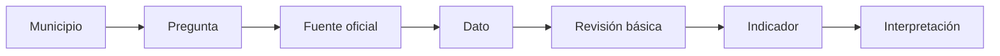
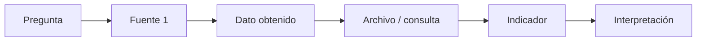
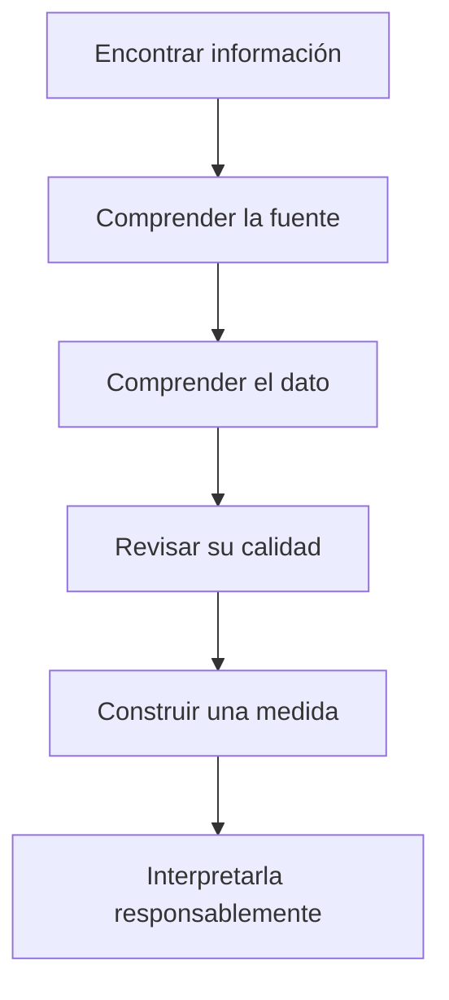

# Reto final — Boyacá 360°

**Curso:** Analítica de Datos e Inteligencia Artificial para la Gestión Pública  
**Entidad:** Contraloría General de Boyacá  
**Sesión 1:** Datos e información para la toma de decisiones  
**Actividad final:** Boyacá 360°

---

## Propósito

El reto final integra los conceptos trabajados durante la primera sesión:

- identificación de fuentes;
- búsqueda de información pública;
- registro de metadatos;
- reconocimiento de problemas básicos de calidad;
- construcción de un indicador sencillo;
- interpretación responsable de resultados.

> [!IMPORTANT]
> Este reto no busca demostrar irregularidades, emitir juicios sobre entidades ni realizar auditorías automáticas.
>
> El objetivo es aprender a pasar de una **pregunta** a una **fuente**, de una fuente a un **dato**, y de un dato a una **interpretación documentada**.

---

# 1. El reto

Cada equipo trabajará con un municipio de Boyacá.

El objetivo es construir una ficha básica del territorio utilizando información pública y oficial.

Cada equipo deberá responder:

```text
¿Qué información pública podemos encontrar sobre este territorio,
de dónde proviene,
cómo podemos obtenerla,
qué tan clara es,
y qué indicador sencillo podemos construir con ella?
```

---

# 2. Municipios sugeridos

Cada equipo puede trabajar con uno de los siguientes municipios:

```text
Tunja
Duitama
Sogamoso
Chiquinquirá
Paipa
Puerto Boyacá
Villa de Leyva
Moniquirá
Garagoa
Soatá
```

## Municipio asignado

```text

```

---

# 3. Integrantes

```text
Integrante 1:

Integrante 2:

Integrante 3:

Integrante 4:
```

---

# 4. Regla principal

Toda afirmación incluida en el reto debe estar acompañada de:

```text
Fuente
Fecha de consulta
Periodo
Dato encontrado
```

No se aceptarán afirmaciones como:

```text
"El municipio tiene mucha contratación"
```

si no se puede explicar:

```text
¿De qué fuente salió?
¿Qué periodo se consultó?
¿Qué variable se observó?
¿Qué significa exactamente "mucha"?
```

---

# 5. Fuentes permitidas

Utilice únicamente fuentes oficiales.

Fuentes sugeridas:

- DANE;
- DIVIPOLA;
- TerriData;
- SECOP II;
- Datos Abiertos Colombia;
- CHIP;
- CUIPO;
- MapaInversiones;
- SIA Contralorías, cuando el acceso esté autorizado;
- SIA Observa, cuando el acceso esté autorizado;
- Contraloría General de Boyacá.

---

# 6. Ruta general del reto



---

# 7. Parte 1 — Identificación territorial

Localice la información básica del municipio.

## Nombre oficial

```text

```

## Código DIVIPOLA

```text

```

## Departamento

```text

```

## Fuente utilizada

```text

```

## Enlace

```text

```

## Fecha de consulta

```text

```

---

# 8. Parte 2 — Información de población

Consulte una fuente oficial de información poblacional.

## Fuente

```text

```

## Producto consultado

```text

```

## Población encontrada

```text

```

## Año o periodo

```text

```

## Unidad

```text
Personas
```

## Enlace

```text

```

## Fecha de consulta

```text

```

---

# 9. Parte 3 — Información territorial complementaria

Utilice TerriData o DANE para localizar al menos un dato adicional del municipio.

Puede seleccionar información relacionada con:

- población;
- educación;
- salud;
- economía;
- territorio;
- finanzas;
- condiciones sociales.

## Variable seleccionada

```text

```

## Valor

```text

```

## Unidad

```text

```

## Periodo

```text

```

## Fuente

```text

```

## Enlace

```text

```

## Fecha de consulta

```text

```

---

# 10. Parte 4 — Contratación pública

Utilice una fuente oficial relacionada con contratación.

Fuente recomendada:

```text
SECOP II — Procesos de Contratación
```

## Entidad o criterio utilizado

```text

```

## Municipio

```text

```

## Periodo consultado

```text

```

## Filtros utilizados

```text


```

## Número de registros observados

```text

```

## Fuente

```text

```

## Enlace

```text

```

## Fecha de consulta

```text

```

---

# 11. Registro de al menos un proceso

Seleccione un proceso visible en la fuente.

## ID del proceso

```text

```

## Entidad

```text

```

## Descripción u objeto

```text


```

## Modalidad

```text

```

## Estado

```text

```

## Valor visible

```text

```

## Fecha asociada

```text

```

> [!NOTE]
> El hecho de encontrar un proceso con determinado valor, modalidad o estado no permite concluir que exista una irregularidad.

---

# 12. Parte 5 — Inversión pública

Utilice MapaInversiones para identificar un proyecto relacionado con el municipio.

## Nombre del proyecto

```text


```

## Sector

```text

```

## Entidad responsable

```text

```

## Vigencia

```text

```

## Estado

```text

```

## Valor visible

```text

```

## Fuente

```text

```

## Enlace

```text

```

## Fecha de consulta

```text

```

---

# 13. Parte 6 — Información presupuestal o financiera

Consulte CHIP, CUIPO u otra fuente oficial disponible.

## Entidad consultada

```text

```

## Categoría

```text

```

## Formulario o reporte

```text

```

## Periodo

```text

```

## Dato encontrado

```text


```

## Unidad

```text

```

## Fuente

```text

```

## Enlace

```text

```

## Fecha de consulta

```text

```

---

# 14. Parte 7 — Evaluación de una fuente

Seleccione una de las fuentes utilizadas y complete una evaluación rápida.

## Fuente seleccionada

```text

```

## Entidad responsable

```text

```

## ¿Qué información contiene?

```text


```

## ¿Cómo se accede?

- [ ] Público sin registro
- [ ] Público con registro
- [ ] Usuario institucional
- [ ] Otro

## ¿Permite descargar información?

- [ ] Sí
- [ ] No
- [ ] Parcialmente
- [ ] Depende del perfil

## Formato disponible

```text

```

## Fecha de actualización visible

```text

```

## ¿Tiene documentación?

- [ ] Sí
- [ ] No
- [ ] No fue posible determinarlo

## Principal fortaleza

```text


```

## Principal limitación

```text


```

---

# 15. Parte 8 — Calidad básica de los datos

Seleccione uno de los archivos o conjuntos consultados.

Revise al menos cinco aspectos.

| Aspecto | ¿Se presenta? | Observación |
|---|---|---|
| Valores faltantes | | |
| Formatos inconsistentes | | |
| Nombres escritos de varias maneras | | |
| Identificadores incompletos | | |
| Fechas con distintos formatos | | |
| Duplicados visibles | | |
| Variables sin explicación clara | | |
| Unidad de medida no identificada | | |

---

# 16. Preguntas de calidad

## ¿La fuente indica claramente qué representa cada registro?

- [ ] Sí
- [ ] Parcialmente
- [ ] No

## ¿La fecha de actualización está visible?

- [ ] Sí
- [ ] No

## ¿La cobertura territorial está clara?

- [ ] Sí
- [ ] No

## ¿El periodo está claramente definido?

- [ ] Sí
- [ ] No

## ¿Las variables principales están documentadas?

- [ ] Sí
- [ ] Parcialmente
- [ ] No

---

# 17. Parte 9 — Construcción de un indicador

Construya un indicador sencillo utilizando información encontrada durante el reto.

Debe ser posible explicar:

```text
Qué mide
Cómo se calcula
Qué datos utiliza
De qué fuente proviene
A qué periodo corresponde
```

---

# 18. Nombre del indicador

```text

```

---

# 19. Pregunta que responde

```text


```

---

# 20. Tipo de indicador

- [ ] Conteo
- [ ] Suma
- [ ] Porcentaje
- [ ] Proporción
- [ ] Promedio
- [ ] Variación
- [ ] Otro

### Otro

```text

```

---

# 21. Fórmula

```text


```

---

# 22. Numerador

```text

```

---

# 23. Denominador

Si no aplica:

```text
No aplica
```

```text

```

---

# 24. Unidad

```text

```

---

# 25. Fuente

```text

```

---

# 26. Periodo

```text

```

---

# 27. Resultado

```text

```

---

# 28. Interpretación

Complete:

> El indicador muestra que...

```text


```

---

# 29. ¿Qué NO permite concluir?

Complete:

```text


```

---

# 30. Ejemplos de indicadores permitidos

Estos ejemplos pueden utilizarse como referencia.

## Ejemplo A — Conteo

```text
Número de procesos de contratación encontrados para una entidad durante una vigencia.
```

---

## Ejemplo B — Suma

```text
Valor total de los registros seleccionados dentro del conjunto consultado.
```

---

## Ejemplo C — Porcentaje

```text
Registros con información completa
/
Total de registros revisados
× 100
```

---

## Ejemplo D — Presupuesto

```text
Valor comprometido
/
Presupuesto definitivo
× 100
```

Siempre que ambos datos correspondan al mismo contexto y periodo.

---

# 31. Indicadores que no deben utilizarse sin definición

Evite expresiones como:

```text
Nivel de corrupción
Nivel de riesgo
Eficiencia general
Gestión buena
Gestión mala
Municipio sospechoso
```

si no existe una definición metodológica formal que permita construirlos.

---

# 32. Parte 10 — Interpretación responsable

Redacte un párrafo de máximo cinco líneas.

Debe separar claramente:

```text
Lo que los datos muestran
Lo que puede describirse
Lo que todavía requiere verificación
```

### Interpretación

```text


```

---

# 33. Frases que pueden utilizarse

Ejemplos de redacción responsable:

```text
Durante el periodo consultado, la fuente registra...
```

```text
El conjunto de datos muestra...
```

```text
Según la información disponible en...
```

```text
El indicador calculado corresponde a...
```

```text
Este resultado describe...
```

```text
Para ampliar la interpretación sería necesario consultar...
```

---

# 34. Frases que deben evitarse

Evite afirmaciones como:

```text
Esto demuestra corrupción.
```

```text
La entidad está administrando mal los recursos.
```

```text
Este contrato es irregular.
```

```text
Este municipio es ineficiente.
```

si los datos utilizados no permiten demostrarlo.

---

# 35. Parte 11 — Trazabilidad

Complete la ruta seguida durante el reto.



## Pregunta inicial

```text

```

## Fuente principal

```text

```

## Archivo o reporte utilizado

```text

```

## Filtro aplicado

```text

```

## Indicador construido

```text

```

## Fecha de consulta

```text

```

---

# 36. Registro de fuentes utilizadas

Complete una fila por cada fuente.

| Fuente | Entidad responsable | Enlace | Periodo | Fecha de consulta | Información obtenida |
|---|---|---|---|---|---|
| | | | | | |
| | | | | | |
| | | | | | |
| | | | | | |

---

# 37. Archivos descargados

Si descargó archivos, regístrelos.

| Archivo | Fuente | Formato | Fecha de descarga |
|---|---|---|---|
| | | | |
| | | | |
| | | | |

---

# 38. ¿Qué fuente fue más fácil de utilizar?

```text


```

---

# 39. ¿Qué fuente fue más difícil de utilizar?

```text


```

---

# 40. ¿Qué fuente ofreció mejores opciones de descarga?

```text


```

---

# 41. ¿Qué fuente tenía mejores metadatos?

```text


```

---

# 42. ¿Qué dato fue más difícil de interpretar?

```text


```

---

# 43. ¿Qué información adicional habría sido útil?

```text


```

---

# 44. Ficha resumen — Boyacá 360°

## Municipio

```text

```

## Código DIVIPOLA

```text

```

## Población consultada

```text

```

## Periodo

```text

```

## Número de procesos de contratación observados

```text

```

## Proyecto de inversión seleccionado

```text

```

## Información presupuestal consultada

```text

```

## Indicador construido

```text

```

## Resultado

```text

```

## Principal fuente utilizada

```text

```

---

# 45. Presentación final

Cada equipo dispondrá de una presentación corta.

Debe explicar únicamente:

```text
1. Municipio asignado
2. Fuentes consultadas
3. Dato principal encontrado
4. Problema de calidad identificado
5. Indicador construido
6. Interpretación
```

---

# 46. Regla para la presentación

No se evaluará quién encontró:

```text
el valor más grande,
el contrato más costoso,
el municipio con mayor ejecución,
o el dato más llamativo.
```

Se evaluará la capacidad de explicar:

```text
de dónde salió el dato,
qué significa,
cómo se obtuvo,
qué limitaciones tiene,
y cómo se construyó el indicador.
```

---

# 47. Lista de verificación antes de entregar

## Fuentes

- [ ] Utilizamos únicamente fuentes oficiales.
- [ ] Registramos los enlaces.
- [ ] Registramos las fechas de consulta.
- [ ] Identificamos la entidad responsable.

## Datos

- [ ] Registramos el periodo.
- [ ] Identificamos la unidad.
- [ ] Revisamos problemas básicos de calidad.
- [ ] No inventamos valores faltantes.

## Indicador

- [ ] Tiene nombre.
- [ ] Tiene fórmula.
- [ ] Tiene unidad.
- [ ] Tiene fuente.
- [ ] Tiene periodo.
- [ ] Puede reproducirse.

## Interpretación

- [ ] La conclusión se basa en los datos.
- [ ] Diferenciamos dato de opinión.
- [ ] Indicamos las limitaciones.
- [ ] No afirmamos irregularidades sin evidencia suficiente.

---

# 48. Entregable final

Cada equipo debe entregar una ficha que contenga:

```text
Municipio
Código DIVIPOLA
Fuentes consultadas
Enlaces
Fechas de consulta
Información poblacional
Información territorial
Información contractual
Información de inversión
Información presupuestal o financiera
Evaluación de una fuente
Problemas de calidad identificados
Indicador
Resultado
Interpretación
Limitaciones
```

---

# 49. Criterios de revisión

| Criterio | Cumple | Requiere ajuste |
|---|:---:|:---:|
| Fuentes oficiales correctamente identificadas | [ ] | [ ] |
| Enlaces registrados | [ ] | [ ] |
| Periodos documentados | [ ] | [ ] |
| Datos comprensibles | [ ] | [ ] |
| Calidad básica revisada | [ ] | [ ] |
| Indicador correctamente definido | [ ] | [ ] |
| Fórmula documentada | [ ] | [ ] |
| Interpretación responsable | [ ] | [ ] |
| Limitaciones reconocidas | [ ] | [ ] |
| Trazabilidad del ejercicio | [ ] | [ ] |

---

# 50. Idea central del reto



El resultado más importante del reto no es un número.

Es poder responder con claridad:

> **¿De dónde salió este dato, qué significa y hasta dónde puedo utilizarlo para sustentar una afirmación?**
