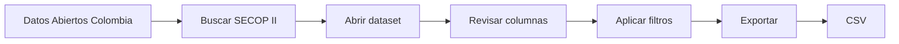
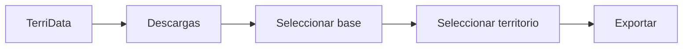
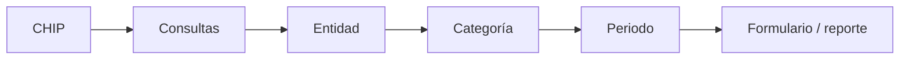
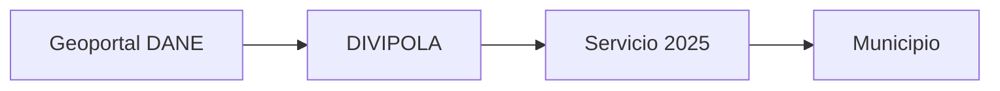
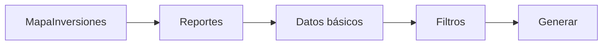
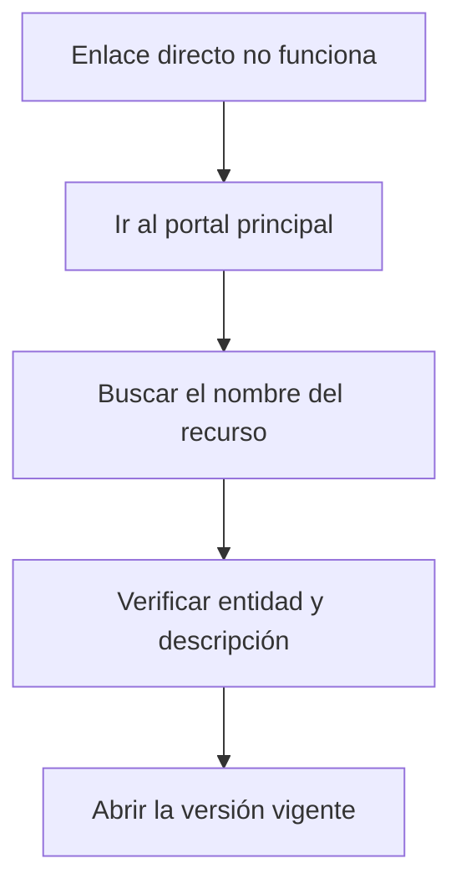
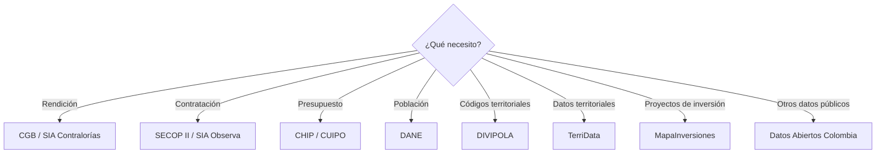

# Directorio de portales y documentación

**Curso:** Analítica de Datos e Inteligencia Artificial para la Gestión Pública  
**Entidad:** Contraloría General de Boyacá  
**Sesión 1:** Datos e información para la toma de decisiones  
**Documento:** Recursos y enlaces de consulta  
**Actualización:** octubre de 2026

---

## Propósito

Este documento reúne los principales portales, conjuntos de datos y recursos de documentación utilizados durante la primera sesión.

El objetivo es disponer de un punto único para acceder a:

- fuentes oficiales;
- sistemas de consulta;
- portales de datos abiertos;
- datasets;
- documentación;
- diccionarios de datos;
- recursos de apoyo.

> [!IMPORTANT]
> Los portales públicos pueden modificar su estructura, sus rutas de navegación o sus conjuntos de datos con el tiempo.
>
> Si un enlace directo deja de funcionar, ingrese primero al portal principal de la entidad y busque el nombre del recurso indicado en esta guía.

---

# 1. Accesos principales

| Tema | Fuente principal | Acceso |
|---|---|---|
| Rendición de cuentas | Contraloría General de Boyacá | [Abrir](https://cgb.gov.co/inicio/rendicion-de-cuentas/) |
| SIA Contralorías | Auditoría General de la República | [Abrir](https://siacontralorias.auditoria.gov.co/) |
| SIA Observa | Auditoría General de la República | [Abrir](https://siaobserva.auditoria.gov.co/Login.aspx?redirect=Inicio) |
| Contratación | SECOP II / Datos Abiertos | [Abrir](https://www.datos.gov.co/) |
| Información presupuestal | CHIP / CUIPO | [Abrir](https://www.chip.gov.co/) |
| Estadísticas oficiales | DANE | [Abrir](https://www.dane.gov.co/) |
| Microdatos | DANE | [Abrir](https://microdatos.dane.gov.co/catalog/central) |
| Información geográfica | Geoportal DANE | [Abrir](https://geoportal.dane.gov.co/) |
| Información territorial | TerriData | [Abrir](https://terridata.dnp.gov.co/) |
| Inversión pública | MapaInversiones | [Abrir](https://mapainversiones.dnp.gov.co/) |
| Datos abiertos nacionales | Datos Abiertos Colombia | [Abrir](https://www.datos.gov.co/) |

---

# 2. Contraloría General de Boyacá

## Portal institucional

[Contraloría General de Boyacá](https://cgb.gov.co/)

---

## Formatos de rendición de cuentas

[Formatos de rendición de cuentas](https://cgb.gov.co/inicio/rendicion-de-cuentas/)

En esta sección pueden consultarse formatos relacionados con:

```text
Catálogo de cuentas
Movimientos bancarios
Pólizas
Ejecución presupuestal de ingresos
Relación de ingresos
Ejecución presupuestal de gastos
Relación de pagos
Modificaciones presupuestales
Reservas
Cuentas por pagar
Contratación
Deuda pública
Fiducias
Inversión ambiental
```

Entre los formatos publicados se encuentran:

```text
F01_AGR
F03CDN
F04AGR
F06_AGR
F06A_CDN
F07_AGR
F07B
F08A_AGR
F08B_AGR
F10_AGR
F11_AGR
F13A_AGR
F18A_CGB
F18B_CGB
F20_2-AGR
```

---

## Datos abiertos

[Contraloría General de Boyacá — Datos abiertos](https://cgb.gov.co/inicio/participacion-ciudadana/datos-abiertos/)

---

## Rendición de cuentas institucional

[Contraloría General de Boyacá — Rendición de cuentas](https://cgb.gov.co/inicio/rendicion-de-cuentas-cgb/)

En esta sección pueden encontrarse informes de gestión y documentos institucionales de diferentes vigencias.

---

## Tutoriales SIA Observa

[Tutoriales SIA Observa — Contraloría General de Boyacá](https://cgb.gov.co/inicio/tutoriales-sia-observa/)

Los recursos publicados incluyen guías sobre temas como:

- validación de usuario;
- administración de contratistas;
- vinculación de contratistas;
- contratos con varias vigencias;
- módulo de ejecución;
- proceso de rendición;
- configuración y uso de módulos.

---

# 3. SIA Contralorías

## Acceso

[SIA Contralorías](https://siacontralorias.auditoria.gov.co/)

---

## Uso general

SIA Contralorías es un sistema institucional utilizado para procesos de rendición de información.

El acceso a:

```text
consultas
reportes
archivos
históricos
exportaciones
```

puede depender del perfil institucional del usuario.

---

## Recurso de apoyo

La Contraloría General de Boyacá mantiene los formatos asociados a la rendición en:

[Formatos de rendición — CGB](https://cgb.gov.co/inicio/rendicion-de-cuentas/)

---

# 4. SIA Observa

## Acceso

[SIA Observa](https://siaobserva.auditoria.gov.co/Login.aspx?redirect=Inicio)

---

## Tutoriales

[Tutoriales SIA Observa — CGB](https://cgb.gov.co/inicio/tutoriales-sia-observa/)

---

## Tipo de información

Dependiendo de los permisos disponibles, puede encontrarse información relacionada con:

```text
Contratos
Entidades
Contratistas
Valores
Fechas
Ejecución
Información contractual reportada
```

---

# 5. Datos Abiertos Colombia

## Portal principal

[Datos Abiertos Colombia](https://www.datos.gov.co/)

---

## ¿Qué permite hacer?

El portal permite:

- buscar datasets;
- consultar información;
- revisar columnas;
- aplicar filtros;
- exportar datos;
- acceder a archivos;
- consultar datos mediante API;
- utilizar OData en conjuntos compatibles.

---

## Búsquedas sugeridas

Dentro del portal pueden utilizarse términos como:

```text
Boyacá
SECOP
contratación
presupuesto
municipios
deuda pública
inversión
educación
salud
```

---

# 6. SECOP II — Procesos de Contratación

## Dataset oficial

[SECOP II — Procesos de Contratación](https://www.datos.gov.co/w/p6dx-8zbt)

---

## Identificador

```text
p6dx-8zbt
```

---

## Descripción

Contiene procesos de compra registrados en SECOP II, sean o no adjudicados.

---

## Variables disponibles

Entre las columnas publicadas se encuentran:

```text
Entidad
NIT Entidad
Departamento Entidad
Ciudad Entidad
ID del Proceso
Referencia del Proceso
Nombre del Procedimiento
Descripción del Procedimiento
Fase
Fechas de publicación
Precio Base
Modalidad de Contratación
```

---

## Cobertura

```text
Nacional
```

---

## Frecuencia publicada

```text
Diaria
```

---

## Acceso directo en JSON

```text
https://www.datos.gov.co/resource/p6dx-8zbt.json
```

> [!NOTE]
> Este enlace permite observar que el mismo conjunto de datos puede ser consultado fuera de la tabla visual del portal.
>
> En esta sesión no es necesario programar consultas.

---

# 7. SECOP II — Contratos Electrónicos

## Dataset oficial

[SECOP II — Contratos Electrónicos](https://www.datos.gov.co/Gastos-Gubernamentales/SECOP-II-Contratos-Electr-nicos/jbjy-vk9h)

---

## Identificador

```text
jbjy-vk9h
```

---

## Descripción

Contiene información de contratos registrados en SECOP II.

Entre las variables disponibles se encuentran:

```text
Nombre Entidad
NIT Entidad
Departamento
Ciudad
Proceso de Compra
ID Contrato
Referencia del Contrato
Estado Contrato
Descripción del Proceso
Proveedor
Valores
Fechas
```

---

## Cobertura

```text
Nacional
```

---

## Frecuencia publicada

```text
Diaria
```

---

## Acceso directo en JSON

```text
https://www.datos.gov.co/resource/jbjy-vk9h.json
```

---

## Diccionario de datos

El propio dataset dispone de documentación asociada.

[Diccionario de datos — SECOP II Contratos Electrónicos](https://datos.gov.co/api/views/jbjy-vk9h/files/9bddd846-dbec-44e4-ad07-682f96adfcda?download=true&filename=DiccionarioDeDatosAbiertos.pdf)

---

# 8. Colombia Compra Eficiente — Datos abiertos

## Portal de conjuntos de datos

[Colombia Compra Eficiente — Conjuntos de datos abiertos](https://operaciones.colombiacompra.gov.co/transparencia/conjuntos-de-datos-abiertos)

---

## Algunos conjuntos disponibles

Dentro del catálogo pueden encontrarse conjuntos como:

```text
SECOP II - Procesos de Contratación
SECOP II - Proveedores Registrados
SECOP II - Adiciones
Proponentes por Proceso SECOP II
SECOP II - Rubros Presupuestales
SECOP II - Facturas
SECOP II - Ubicaciones Adicionales
SECOP II - Compromisos Presupuestales
SECOP II - Solicitudes CDPs
SECOP II - PAA
SECOP II - Garantías
SECOP II - Contratos
SECOP II - Ofertas por Proceso
SECOP Integrado
Tienda Virtual del Estado Colombiano
```

---

## Portal institucional

[Colombia Compra Eficiente](https://www.colombiacompra.gov.co/)

---

# 9. OData en Datos Abiertos Colombia

Los conjuntos publicados en la plataforma pueden ofrecer acceso mediante OData.

La ruta se encuentra normalmente dentro de:

```text
Dataset
    ↓
Exportar
    ↓
OData
```

El portal muestra el punto de acceso correspondiente al conjunto seleccionado.

---

# 10. API de Datos Abiertos Colombia

Los conjuntos de datos publicados en la plataforma Socrata pueden consultarse utilizando el identificador del dataset.

Estructura conceptual:

```text
https://www.datos.gov.co/resource/ID_DEL_DATASET.json
```

Ejemplo SECOP Procesos:

```text
https://www.datos.gov.co/resource/p6dx-8zbt.json
```

Ejemplo SECOP Contratos:

```text
https://www.datos.gov.co/resource/jbjy-vk9h.json
```

Durante esta sesión solamente es necesario reconocer esta posibilidad de acceso.

---

# 11. CHIP — Consolidador de Hacienda e Información Pública

## Portal principal

[CHIP](https://www.chip.gov.co/)

---

## Página de consultas

[CHIP — Consultas](https://www.chip.gov.co/inicio/consulta)

---

## Aplicativo CHIP

[Aplicativo web CHIP](https://www.chip.gov.co/SCHIPWeb2_0/)

---

## Información disponible

El ecosistema CHIP incluye categorías relacionadas con:

```text
CGN
CGR
CUIPO
FUT
CONPES
BDME
UAPA-PAE
SIGUEME
```

La información disponible depende de:

- entidad;
- categoría;
- periodo;
- formulario;
- tipo de consulta.

---

# 12. CUIPO

## Significado

```text
Categoría Única de Información del Presupuesto Ordinario
```

---

## Página de apoyo

[CHIP — CUIPO](https://www.chip.gov.co/inicio/apoyo/cuipo/1)

---

## Recursos disponibles

Dentro de los recursos de CHIP pueden encontrarse:

- documentación;
- categorías;
- instructivos;
- archivos de apoyo;
- protocolos;
- información de reporte.

---

# 13. Protocolo de importación CHIP

## Acceso

[CHIP — Protocolo de importación](https://www.chip.gov.co/inicio/consulta/protocolo)

Este recurso permite seleccionar información como:

```text
Año
Entidad
Categoría
```

para consultar el formato correspondiente.

---

# 14. Mapa del sitio CHIP

[CHIP — Mapa del sitio](https://www.chip.gov.co/inicio/sitemap)

Puede ser útil cuando una sección no se encuentra fácilmente desde el menú principal.

---

# 15. DANE

## Portal principal

[DANE](https://www.dane.gov.co/)

---

## Información disponible

El DANE publica información oficial sobre áreas como:

```text
Población
Demografía
Mercado laboral
Pobreza
Precios
Educación
Economía
Comercio
Construcción
Territorio
Agricultura
Censos
Encuestas
Proyecciones
```

---

# 16. Catálogo Central de Microdatos DANE

## Acceso

[Catálogo Central de Datos — DANE](https://microdatos.dane.gov.co/catalog/central)

---

## ¿Qué contiene?

El catálogo publica:

```text
Metadatos
Microdatos anonimizados
Documentación
Cuestionarios
Diccionarios
Archivos de datos
```

Las operaciones estadísticas se organizan en grandes áreas como:

```text
Sociedad
Economía
Territorio
```

---

# 17. Geoportal DANE

## Acceso

[Geoportal DANE](https://geoportal.dane.gov.co/)

---

## Información disponible

El Geoportal permite acceder a:

- información geográfica;
- mapas;
- geovisores;
- límites territoriales;
- Marco Geoestadístico Nacional;
- servicios geográficos.

---

# 18. DIVIPOLA

## Directorio de servicios

[DANE — Servicios DIVIPOLA](https://geoportal.dane.gov.co/mparcgis/rest/services/Divipola)

---

## Servicio DIVIPOLA MGN 2025

[DIVIPOLA MGN 2025 — FeatureServer](https://geoportal.dane.gov.co/mparcgis/rest/services/Divipola/Serv_DIVIPOLA_MGN_2025/FeatureServer)

---

## Capas disponibles

El servicio incluye capas correspondientes a:

```text
Centros Poblados
Municipio
Departamento
```

---

## Formatos de consulta compatibles

Dependiendo de la capa, el servicio permite consultas en formatos como:

```text
JSON
GeoJSON
PBF
```

---

# 19. Capa de municipios DIVIPOLA

Desde el servicio DIVIPOLA pueden consultarse las capas disponibles.

Ruta principal:

[DIVIPOLA MGN 2025](https://geoportal.dane.gov.co/mparcgis/rest/services/Divipola/Serv_DIVIPOLA_MGN_2025/FeatureServer)

Seleccione la capa:

```text
Municipio
```

para revisar:

- campos;
- códigos;
- nombres;
- propiedades geográficas.

---

# 20. Proyecciones de población DANE

## Visor

[DANE — Visor de Proyecciones de Población](https://sitios.dane.gov.co/visor-de-proyecciones-de-poblacion/)

---

## Importante

Un visor permite consultar rápidamente información.

Para obtener datasets reutilizables también deben revisarse:

```text
Anexos
Descargas
Archivos Excel
Microdatos
Recursos asociados
```

cuando estén disponibles para el producto estadístico consultado.

---

# 21. TerriData

## Portal principal

[TerriData — DNP](https://terridata.dnp.gov.co/)

---

## Secciones principales

El portal dispone de:

```text
Fichas
Comparaciones
Descargas
Reportes
Triage poblacional
Fichas PDET
Boletines
```

---

## Descargas

Para obtener bases de datos:

```text
TerriData
    ↓
Descargas
    ↓
Seleccionar base
    ↓
Seleccionar territorio
    ↓
Exportar
```

---

## Uso para Boyacá

Puede utilizarse para consultar:

```text
Boyacá
Municipios de Boyacá
```

y diferentes variables territoriales disponibles en la plataforma.

---

# 22. MapaInversiones

## Portal principal

[MapaInversiones — DNP](https://mapainversiones.dnp.gov.co/)

---

## Buscador

[MapaInversiones — Buscador](https://mapainversiones.dnp.gov.co/Buscador/)

---

## Reporte de proyectos — Datos básicos

[MapaInversiones — Datos básicos](https://mapainversiones.dnp.gov.co/reportes/datosbasicos)

---

## Ficha territorial y proyectos

[MapaInversiones — Ficha territorial](https://mapainversiones.dnp.gov.co/Home/FichaTerritorialProyectos)

Las fichas territoriales pueden mostrar información como:

```text
Presupuesto aprobado
Presupuesto ejecutado
Avance físico
Avance financiero
Fuente de datos
Última actualización
Corte de los datos
```

y pueden incluir una opción de:

```text
Descargar el reporte completo
```

---

## Mapa del sitio

[MapaInversiones — Mapa del sitio](https://mapainversiones.dnp.gov.co/Home/SiteMapMI)

---

# 23. Fuentes oficiales por necesidad

## Necesito información de contratación

Primera opción:

[SECOP II — Procesos de Contratación](https://www.datos.gov.co/w/p6dx-8zbt)

Para contratos:

[SECOP II — Contratos Electrónicos](https://www.datos.gov.co/Gastos-Gubernamentales/SECOP-II-Contratos-Electr-nicos/jbjy-vk9h)

Para consultar otros conjuntos:

[Colombia Compra Eficiente — Datos abiertos](https://operaciones.colombiacompra.gov.co/transparencia/conjuntos-de-datos-abiertos)

---

## Necesito información rendida a la Contraloría

[Contraloría General de Boyacá — Rendición](https://cgb.gov.co/inicio/rendicion-de-cuentas/)

[SIA Contralorías](https://siacontralorias.auditoria.gov.co/)

---

## Necesito información contractual reportada en SIA

[SIA Observa](https://siaobserva.auditoria.gov.co/Login.aspx?redirect=Inicio)

[Tutoriales SIA Observa](https://cgb.gov.co/inicio/tutoriales-sia-observa/)

---

## Necesito información presupuestal

[CHIP](https://www.chip.gov.co/)

[CHIP — Consultas](https://www.chip.gov.co/inicio/consulta)

[CHIP — CUIPO](https://www.chip.gov.co/inicio/apoyo/cuipo/1)

---

## Necesito estadísticas oficiales

[DANE](https://www.dane.gov.co/)

---

## Necesito microdatos

[Microdatos DANE](https://microdatos.dane.gov.co/catalog/central)

---

## Necesito códigos territoriales

[DIVIPOLA — DANE](https://geoportal.dane.gov.co/mparcgis/rest/services/Divipola)

---

## Necesito información territorial

[TerriData](https://terridata.dnp.gov.co/)

---

## Necesito proyectos de inversión pública

[MapaInversiones](https://mapainversiones.dnp.gov.co/)

---

## Necesito encontrar otro dataset público

[Datos Abiertos Colombia](https://www.datos.gov.co/)

---

# 24. Fuentes internacionales

Las fuentes nacionales son las principales para las actividades de esta sesión.

Las siguientes fuentes internacionales permiten conocer estándares y consultar información comparable.

---

# 25. Open Contracting Data Standard — OCDS

## Documentación en español

[Open Contracting Data Standard — Español](https://standard.open-contracting.org/latest/es/)

---

## ¿Qué contiene?

La documentación explica un estándar común para representar información de contratación pública.

Incluye secciones sobre:

```text
Introducción
Guía
Referencia
Esquemas
Listas de códigos
Reglas de publicación
Herramientas de revisión
```

---

## Open Contracting Partnership

[Open Contracting Partnership](https://www.open-contracting.org/)

---

# 26. Banco Mundial — Open Data

## Portal

[World Bank Open Data](https://data.worldbank.org/)

---

## API de indicadores

[World Bank — Indicators API](https://datahelpdesk.worldbank.org/knowledgebase/articles/889392-about-the-indicators-api-documentation)

---

## Estructura básica de consultas API

[World Bank — API Basic Call Structures](https://datahelpdesk.worldbank.org/knowledgebase/articles/898581-api-basic-call-structures)

La API permite acceder programáticamente a miles de series de indicadores.

En esta sesión solamente es necesario reconocer que esta forma de acceso existe.

---

# 27. OECD Data Explorer

## Acceso

[OECD Data Explorer](https://data-explorer.oecd.org/)

---

## Temas disponibles

Entre otros:

```text
Gobierno
Economía
Educación
Empleo
Desarrollo
Medio ambiente
Cuentas nacionales
Indicadores subnacionales
```

---

# 28. Banco Interamericano de Desarrollo

## Datos Abiertos del BID

[BID — Datos Abiertos](https://data.iadb.org/es/)

---

## Portales especializados

[BID — Portales de datos](https://data.iadb.org/es/data-portals)

El catálogo incluye:

- conjuntos de datos;
- datos de investigación;
- indicadores;
- portales temáticos.

---

# 29. Tabla de enlaces esenciales para las actividades

| Recurso | Enlace |
|---|---|
| Contraloría General de Boyacá | https://cgb.gov.co/ |
| Rendición CGB | https://cgb.gov.co/inicio/rendicion-de-cuentas/ |
| Tutoriales SIA Observa | https://cgb.gov.co/inicio/tutoriales-sia-observa/ |
| SIA Contralorías | https://siacontralorias.auditoria.gov.co/ |
| SIA Observa | https://siaobserva.auditoria.gov.co/Login.aspx?redirect=Inicio |
| Datos Abiertos Colombia | https://www.datos.gov.co/ |
| SECOP II Procesos | https://www.datos.gov.co/w/p6dx-8zbt |
| SECOP II Contratos | https://www.datos.gov.co/Gastos-Gubernamentales/SECOP-II-Contratos-Electr-nicos/jbjy-vk9h |
| Colombia Compra — Datos abiertos | https://operaciones.colombiacompra.gov.co/transparencia/conjuntos-de-datos-abiertos |
| CHIP | https://www.chip.gov.co/ |
| CHIP Consultas | https://www.chip.gov.co/inicio/consulta |
| CHIP CUIPO | https://www.chip.gov.co/inicio/apoyo/cuipo/1 |
| DANE | https://www.dane.gov.co/ |
| Microdatos DANE | https://microdatos.dane.gov.co/catalog/central |
| Geoportal DANE | https://geoportal.dane.gov.co/ |
| DIVIPOLA | https://geoportal.dane.gov.co/mparcgis/rest/services/Divipola |
| TerriData | https://terridata.dnp.gov.co/ |
| MapaInversiones | https://mapainversiones.dnp.gov.co/ |
| OCDS | https://standard.open-contracting.org/latest/es/ |
| Banco Mundial | https://data.worldbank.org/ |
| OECD Data Explorer | https://data-explorer.oecd.org/ |
| BID Datos Abiertos | https://data.iadb.org/es/ |

---

# 30. Tabla de datasets y servicios directos

| Recurso | Identificador / servicio | Acceso |
|---|---|---|
| SECOP II — Procesos | `p6dx-8zbt` | [Dataset](https://www.datos.gov.co/w/p6dx-8zbt) |
| SECOP II — Contratos | `jbjy-vk9h` | [Dataset](https://www.datos.gov.co/Gastos-Gubernamentales/SECOP-II-Contratos-Electr-nicos/jbjy-vk9h) |
| SECOP Procesos JSON | `p6dx-8zbt` | [JSON](https://www.datos.gov.co/resource/p6dx-8zbt.json) |
| SECOP Contratos JSON | `jbjy-vk9h` | [JSON](https://www.datos.gov.co/resource/jbjy-vk9h.json) |
| DIVIPOLA | `Serv_DIVIPOLA_MGN_2025` | [FeatureServer](https://geoportal.dane.gov.co/mparcgis/rest/services/Divipola/Serv_DIVIPOLA_MGN_2025/FeatureServer) |
| MapaInversiones | Reporte datos básicos | [Reporte](https://mapainversiones.dnp.gov.co/reportes/datosbasicos) |

---

# 31. Tabla de documentación

| Recurso | Documentación |
|---|---|
| CGB | [Formatos de rendición](https://cgb.gov.co/inicio/rendicion-de-cuentas/) |
| SIA Observa | [Tutoriales CGB](https://cgb.gov.co/inicio/tutoriales-sia-observa/) |
| SECOP II Contratos | [Diccionario de datos](https://datos.gov.co/api/views/jbjy-vk9h/files/9bddd846-dbec-44e4-ad07-682f96adfcda?download=true&filename=DiccionarioDeDatosAbiertos.pdf) |
| Colombia Compra | [Catálogo de datos abiertos](https://operaciones.colombiacompra.gov.co/transparencia/conjuntos-de-datos-abiertos) |
| CHIP | [Consultas](https://www.chip.gov.co/inicio/consulta) |
| CUIPO | [Recursos CUIPO](https://www.chip.gov.co/inicio/apoyo/cuipo/1) |
| DANE Microdatos | [Catálogo y metadatos](https://microdatos.dane.gov.co/catalog/central) |
| DIVIPOLA | [Servicios REST](https://geoportal.dane.gov.co/mparcgis/rest/services/Divipola) |
| TerriData | [Portal](https://terridata.dnp.gov.co/) |
| MapaInversiones | [Mapa del sitio](https://mapainversiones.dnp.gov.co/Home/SiteMapMI) |
| OCDS | [Documentación](https://standard.open-contracting.org/latest/es/) |
| Banco Mundial | [API de indicadores](https://datahelpdesk.worldbank.org/knowledgebase/articles/889392-about-the-indicators-api-documentation) |

---

# 32. Ruta rápida para descargar un dataset de SECOP



Para Procesos:

[SECOP II — Procesos](https://www.datos.gov.co/w/p6dx-8zbt)

Para Contratos:

[SECOP II — Contratos](https://www.datos.gov.co/Gastos-Gubernamentales/SECOP-II-Contratos-Electr-nicos/jbjy-vk9h)

---

# 33. Ruta rápida para obtener información territorial



[Ir a TerriData](https://terridata.dnp.gov.co/)

---

# 34. Ruta rápida para información presupuestal



[Ir a CHIP](https://www.chip.gov.co/)

[Ir a Consultas CHIP](https://www.chip.gov.co/inicio/consulta)

---

# 35. Ruta rápida para códigos territoriales



[Ir a DIVIPOLA](https://geoportal.dane.gov.co/mparcgis/rest/services/Divipola)

---

# 36. Ruta rápida para proyectos de inversión



[Ir a MapaInversiones](https://mapainversiones.dnp.gov.co/)

[Ir al reporte de datos básicos](https://mapainversiones.dnp.gov.co/reportes/datosbasicos)

---

# 37. Cómo guardar un enlace útil

Cuando encuentre una fuente que utilizará posteriormente, registre:

```text
Nombre:

Entidad:

URL:

Qué contiene:

Fecha de consulta:

Dataset o sección:

Identificador, si existe:

Observaciones:
```

---

# 38. Cómo reconocer un enlace oficial

Antes de utilizar una fuente, revise el dominio.

Ejemplos utilizados en esta sesión:

```text
cgb.gov.co
auditoria.gov.co
datos.gov.co
colombiacompra.gov.co
chip.gov.co
dane.gov.co
dnp.gov.co
```

En fuentes internacionales:

```text
open-contracting.org
worldbank.org
oecd.org
iadb.org
```

---

# 39. Antes de descargar

Revise siempre:

```text
Quién publica
Qué contiene
Periodo
Cobertura
Fecha de actualización
Columnas
Unidad
Formato de descarga
```

No descargue un archivo únicamente porque su nombre parece relacionado con la pregunta.

---

# 40. Si un enlace no funciona

Siga esta ruta:



Ejemplo:

Si cambia la ruta de:

```text
SECOP II - Procesos de Contratación
```

puede buscarse nuevamente en:

[Datos Abiertos Colombia](https://www.datos.gov.co/)

utilizando su identificador:

```text
p6dx-8zbt
```

---

# 41. Favoritos recomendados

Para las actividades de esta sesión conviene mantener disponibles estos accesos:

1. [Contraloría General de Boyacá — Rendición](https://cgb.gov.co/inicio/rendicion-de-cuentas/)
2. [Datos Abiertos Colombia](https://www.datos.gov.co/)
3. [SECOP II — Procesos](https://www.datos.gov.co/w/p6dx-8zbt)
4. [CHIP](https://www.chip.gov.co/)
5. [DANE](https://www.dane.gov.co/)
6. [Microdatos DANE](https://microdatos.dane.gov.co/catalog/central)
7. [DIVIPOLA](https://geoportal.dane.gov.co/mparcgis/rest/services/Divipola)
8. [TerriData](https://terridata.dnp.gov.co/)
9. [MapaInversiones](https://mapainversiones.dnp.gov.co/)

---

# 42. Directorio resumido por pregunta



---

# 43. Regla de uso de este directorio

Este archivo funciona como un **mapa de acceso**, no como sustituto de la documentación oficial.

Cuando vaya a utilizar un conjunto de datos:

```text
1. Abra el portal.
2. Identifique el recurso.
3. Lea la descripción.
4. Revise los metadatos.
5. Consulte la documentación disponible.
6. Registre la fecha de consulta.
7. Descargue únicamente después de comprender qué contiene.
```

---

# 44. Idea central

> **Encontrar una página no es lo mismo que encontrar una fuente de datos.**

Una fuente útil debe permitir responder, como mínimo:

```text
Quién publica
Qué información contiene
Qué periodo cubre
Cómo se consulta
Cómo se obtiene
Qué documentación existe
```

Este directorio debe utilizarse como punto de partida para localizar la fuente correcta antes de comenzar cualquier trabajo con datos.
